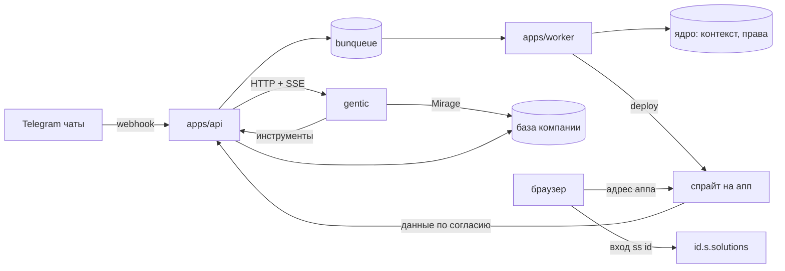

# ss — s.solutions. Архитектура (салфетка)

> Статус: черновик. Только архитектура, кода нет. Один Postgres, один API, один воркер,
> один процесс ботов, одно веб-приложение. Всё остальное — следствия.
>
> Снято 2026-10-05: телеграм-приём в это ядро не завозим. Ботов заводят сами кланкеры,
> данные кладут туда, где выберут. См. `bot-on-cloudflare.md`.

## 1. Продукт на одном экране

**Тезис.** Мы даём компании её собственную базу данных и агентов, которые её крутят. ERP, CRM,
трекер задач — это не разделы нашей системы, а то, что владелец собирает себе сам: миниапп поверх
своей базы. Мы — точка входа и раздатчик доступов.

**Цикл.**

1. **Даём базу.** Компания получает отдельную управляемую базу: свои роли, своя схема, свои таблицы, свои миграции. Выписываем её мы.
2. **Собираем контекст.** Бот сидит в рабочих чатах компании и складывает сообщения туда же, в свою служебную схему.
3. **Даём доступ.** Каждому агенту выдаётся ровно тот уровень: чтение, запись, изменение схемы.
4. **Работаем.** Сотрудник пишет агенту в телеграме или в вебе. Агент ищет по контексту, отвечает, при нужде меняет базу.
5. **Собираем миниаппы.** Владелец с агентом делает себе дашборд, трекер или CRM — миниапп на своём спрайте, читающий базу компании по согласию сотрудника.
6. **Входим.** Все миниаппы компании — под одной дверью у нас: один вход, один список, одни права.

**Что мы продаём.** Не «модуль ERP». Продаём базу компании плюс агента, который умеет её менять, плюс
точку входа во всё, что компания себе собрала.

**Почему сейчас.** С конца 2025 кодинговые агенты стали достаточно хороши, чтобы владелец бизнеса без
инженерного бэкграунда получал работающий софт. Софт под задачу перестал быть продуктом на месяцы.

**Границы (чего не делаем).** Не пишем ERP-модули сами. Не заменяем трекер. Не мессенджер. Не биллинг
(в первой версии). Не мобильное приложение.

## 2. Две базы, и почему их две

Это главное архитектурное решение.

| | Ядро (`ss`) | База компании (на арендатора) |
|---|---|---|
| Что лежит | компании, сотрудники, чаты, сообщения, агенты, аппы, права, реестр баз компаний | всё, что компания себе придумала: её таблицы из миниаппов |
| Кто владеет | мы | компания, руками агентов |
| Кто может менять схему | только наши миграции | агент, с правами и с согласия владельца |
| Сколько | одна на продукт | своя у каждой компании, выписываем мы |
| Где живёт | наш кластер | тот же кластер, отдельная база и отдельные роли |

**Обе есть, и обе нужны.** Наша Postgres держит продукт: кто в компаниях, какие чаты мы читаем, какие
агенты есть и что им разрешено, какие аппы опубликованы, какие правки ждут согласия. База компании —
собственность компании, и в неё агент ходит работать.

**Почему раздельно.** Если агент может менять схему, он однажды удалит не то. Служебные таблицы
(контекст, права, реестр аппов) недосягаемы по построению, а не по обещанию. Поэтому в базе компании
два пространства имён: `ctx` — наша копия контекста, только чтение для агентов; `app` — владение
компании, где агент делает что хочет.

**Почему одна база на компанию, а не кластер на компанию.** Одна база в общем кластере дешевле и
проще: один бэкап, один набор расширений, одна точка наблюдения. Разделение — база, роль и схема, а
не железо. Отдельный кластер заводим, когда попросит крупный клиент; модель данных от этого не меняется.

### 2.1. Выписка базы

База компании — не настройка, а объект, который мы выдаём. Выписка идёт одной задачей `db.provision`:

1. Создать базу `<company>_db` и три роли: только чтение, чтение-запись, плюс изменение схемы.
2. Создать схемы `ctx` (наши представления над контекстом, отфильтрованные по компании) и `app` (владение компании).
3. Выдать права ролям: `ctx` — только чтение для всех; `app` — по уровню каждой роли.
4. Завести запись в `company_databases`: имя базы, имена ролей, кластер, статус.
5. Отдать компании адрес и учётные данные через наш API, а не письмом в чат.

Дальше жизнь базы — тоже наши задачи: `db.migrate` применяет согласованную правку, `db.backup` снимает
копию, `db.suspend` и `db.drop` закрывают базу при отъезде клиента. Всё записано в реестре, поэтому
«у какой компании какая база и что с ней» — это одна таблица, а не память инженера.

## 3. Акторы и сущности

| Сущность | Кто/что это | Ключ |
|---|---|---|
| Company | арендатор. Всё скоупится по ней | `company_id` |
| CompanyDB | выписанная компании база: имя, роли, кластер, состояние | `company_db_id` |
| Membership | человек в компании, роль: owner/admin/member | `(company_id, user_id)` |
| User | вход в систему (better-auth) | `user_id` |
| Source | откуда льётся контекст: телеграм-чат, топик | `(company_id, kind, external_id)` |
| Message | единица контекста | `(source_id, external_id)` |
| Project | то, по чему спрашивают отчёт | `project_id` |
| Agent | агент человека или компании. Обёртка над сессией gentic | `agent_id` |
| Run | один прогон агента: вход, выход, цена | `run_id` |
| Grant | уровень доступа агента к базе компании | `(agent_id, kind)` |
| Change | предложенная правка базы: схема или данные | `change_id` |
| App | опубликованный миниапп на своём спрайте | `app_id` |
| Consent | согласие сотрудника: апп плюс выданные права | `(app_id, user_id)` |

## 4. Шесть потоков



### F1. Сбор контекста

1. Телеграм шлёт webhook в `apps/api`. Секрет проверяется точкой входа, не ядром.
2. Сообщение нормализуется в событие и кладётся в очередь задачей `msg.ingest`. Ответ телеграму — сразу.
3. Воркер: дедуп по `(source_id, external_id)`, запись, связывание с проектом, постановка `msg.enrich`.
4. `msg.enrich`: эмбеддинг, при необходимости пересборка сводки.
5. Правки и удаления доезжают тем же путём. Удалённое исключается из контекста агента, а не остаётся тенью.

### F2. Вопрос

1. Точка входа: веб (SSE) или личка бота. Создаётся `run`.
2. API открывает сессию в gentic и стримит события наверх: текст, вызов инструмента, результат, конец.
3. Инструменты агента — наши эндпоинты под пропуском прогона: `search_context`, `list_projects`, `project_report`, `publish_app`, `update_app`.
4. `run` пишет вход, выход, статус, стоимость. Стрим можно переподключить по `run_id`.

### F3. Правка базы компании

1. Агент описывает правку: миграция схемы или набор данных.
2. Ядро проверяет её чистой функцией: только схема `app`, размер, опасные операции (удаление столбца, удаление таблицы) — отдельным классом.
3. Правка становится записью `changes` и уходит владельцу на согласие. Это тот же механизм, что «спросить перед командой» в Mirage.
4. После согласия воркер применяет миграцию под ролью компании, пишет запись в журнал миграций.
5. Неудача — откат и причина в записи. База не остаётся в половинчатом виде.

### F4. Публикация миниаппа

1. Агент зовёт `publish_app` с манифестом: имя, файлы, точка входа, нужные данные.
2. Ядро проверяет манифест: размер, типы, одна точка входа, нет секретов в исходниках.
3. Задача `app.build`: собрать и развернуть спрайт аппа.
4. Регистрируется клиент входа через ss id: `client_id`, адрес возврата, объявленные права.
5. Карточка появляется в маркетплейсе компании. Видимость: `private` (автор) или `company`.

### F5. Отдача и вход

1. Плановый адрес аппа — `https://<company>-<app>.susercontent.solutions`; все аппы идут через один роутер.
2. Роутер по имени ищет апп и проксирует в его спрайт.
3. Миниапп в браузере — чужой origin: без cookies основного домена, без доступа к родительскому окну.
4. Нет доступа — редирект на вход ss id. Сотрудник сам выдаёт аппу права и видит, какие.
5. Данные — только через `POST /v1/app-data/query` под выданным токеном: имя разрешённого представления плюс параметры. Видно пересечение: права сотрудника ∩ выданные права ∩ его компания.

### F6. Администрирование

Компании, приглашения, роли, источники, доступы агентов, выписка и состояние баз компаний, очередь
правок, маркетплейс. Всё через типизированный клиент к нашему API. Отдельного «внутреннего» API нет.

## 5. Карта модулей (монорепо Bun)

```
ss/
  apps/api/         Hono, два хоста: api.s.solutions и id.s.solutions (сервер авторизации ss id).
                    Пути: /v1/ingest/telegram, /v1/ask, /v1/runs, /v1/changes, /v1/apps,
                    /v1/app-data, /v1/admin, /v1/tools, /oauth2/*
  apps/worker/      консьюмеры bunqueue: msg.ingest, msg.enrich, digest.rollup, db.provision,
                    db.migrate, db.backup, db.suspend, app.build, app.reap, retention.gc
  apps/bot/         телеграм-боты: приём вебхуков, личка = вопрос
  apps/web/         кабинет: компании, сотрудники, доступы агентов, очередь правок, маркетплейс
  packages/core/    чистое ядро. Ноль импортов из db/queue/http/telegram
  packages/db/      схема ядра, миграции, слой запросов со скоупом компании, управление базами компаний
  packages/ports/   адаптеры эффектов: Db, Queue, Llm, Telegram, Sprites, Gentic, Mirage, Clock, Ids
  packages/contracts/ zod-схемы, тип AppType (RPC) для веба, каталог прав (scopes)
  packages/gentic/  клиент к gentic (HTTP+SSE) и наш сервер инструментов
```

Правило: модуль либо владеет потоком, либо даёт порт. Пакет без владельца не заводим.

**Стек и версии (по образцу bychefs.com).**

| Слой | Выбор | Почему так |
|---|---|---|
| Среда | Bun, рабочие области + Turborepo, `apps/*` и `packages/*` | тот же каркас, что в bychefs.com; учить заново нечего |
| Ядро | Postgres 17 + pgvector, `drizzle` + `postgres-js`, один клиент на процесс | образец — `packages/db/src/client.ts`, там же правило «один верхний клиент, никаких фабрик» |
| Базы компаний | тот же кластер, одна база и одна роль на компанию | дешевле и проще кластера на каждого; разделение — роль и схема |
| Схема | `packages/db/src/schema/*.ts`, миграции `drizzle-kit generate` и `migrate`; прод применяет их отдельным юнитом до старта сервисов | в bychefs так сделан `bychefs-migrate` (`before = [jobs, api, web]`) |
| API | Hono + `Bun.serve`; вход лучше-auth висит ловушкой на `/api/auth/*` | образец — `apps/api/src/index.ts` |
| Вход | better-auth 1.7 + `@better-auth/oauth-provider` | свой сервер авторизации не пишем (см. §11) |
| Типы на клиент | `hc<AppType>` (hono client) | ты просил. В bychefs обошлись типами и обычным `fetch`, потому что веб не тянет hono. Если проверка типов начнёт тормозить — вернёмся к их приёму |
| Очередь | bunqueue 2.7, отдельный процесс-брокер по TCP (6789 — задачи, 6790 — обзор) | API как у BullMQ: `Queue`, `Worker`, `QueueEvents`, повторы, backoff, cron, дедуп по `jobId`. Брокер не перезапускаем вместе с релизом приложения |
| Доступ агентов к базе | Mirage: профили, монтирование базы, вопросы-согласия | см. §7 |
| Валидация | zod, только на границе | правило 8 из набора в §8 |
| Ядро системы | одна машина: systemd-юниты + Caddy | bychefs: одна машина, Caddy, секреты через sops |
| Аппы | спрайт на каждый миниапп | см. §12 |

**Четыре грабли из bychefs, которые учитываем сразу.**

1. Встроенный режим bunqueue без `dataPath` держит задачи в памяти и теряет их при перезапуске. У нас всегда брокер и всегда файл на диске.
2. Долгая задача модели обязана иметь явный `timeout`, иначе висит `active` вечно. Ставим его на `msg.enrich`, `db.migrate` и `app.build`.
3. `baseURL` лучше-auth в проде — только origin, без пути: с путём все маршруты входа молча отдают 404.
4. Версия bunqueue 2.7 требует локального патча для замков и сердцебиения во встроенном режиме. Мы этот режим не используем, но патч из bychefs держим наготове.

## 6. Модель данных

### 6.1. Ядро

Один Postgres. Расширение `pgvector` для эмбеддингов. Каждая строка несёт `company_id` прямо или через родителя.

```
companies(id pk, name, slug unique, status, settings jsonb, created_at)
company_databases(id pk, company_id fk unique, db_name unique, roles jsonb, cluster ref,
                  status, provisioned_at, suspended_at, dropped_at)
                  -- roles: имена ролей на чтение, запись и схему; status: provisioning|ready|suspended|dropped
memberships(id pk, company_id fk, user_id fk, role, status, created_at)  -- unique(company_id, user_id)
invites(id pk, company_id fk, email, role, token unique, expires_at, accepted_at)
sources(id pk, company_id fk, kind, external_id, title, ingest_enabled, settings jsonb)
         -- unique(company_id, kind, external_id)
messages(id pk, company_id fk, source_id fk, external_id, thread_id, author_external_id,
         author_name, text, attachments jsonb, sent_at, edited_at, deleted_at, ingested_at, raw jsonb)
         -- unique(source_id, external_id), index(company_id, sent_at)
embeddings(message_id pk fk, model, vec vector)
projects(id pk, company_id fk, name, slug, status, owner_membership_id, created_at)
project_links(project_id fk, message_id fk, confidence, rule, created_at)  -- pk(project_id, message_id)
digests(id pk, company_id fk, project_id fk null, period tstzrange, summary, model, created_at)
agents(id pk, company_id fk, owner_membership_id null, name, kind, system_prompt, tools jsonb,
       gentic jsonb, status, created_at)
db_grants(id pk, agent_id fk, kind, scope jsonb, granted_by, created_at, revoked_at)
         -- kind: read | write | schema; scope: какие схемы и таблицы
runs(id pk, agent_id fk, trigger, input jsonb, output jsonb, status, error, cost_usd, started_at, ended_at)
changes(id pk, company_id fk, agent_id fk, kind, sql text, plan jsonb, status, approved_by null,
        applied_at, error, created_at)
        -- kind: schema | data; status: proposed | approved | applied | failed | rejected
apps(id pk, company_id fk, agent_id fk, slug unique, name, description, source jsonb, sprite jsonb,
     url, visibility, status, version, client_id unique, scopes jsonb, redirect_uri, created_at)
app_installs(app_id fk, membership_id fk, pinned_at)  -- pk(app_id, membership_id)
audit_log(id pk, company_id fk, actor_membership_id null, actor_kind, action, target_type, target_id, meta jsonb, at)
```

Клиентов входа, коды, токены и согласия не дублируем: ими владеет better-auth (`oauth_application`,
`oauth_access_token`, `oauth_consent`). Наша таблица `apps` держит только `client_id`, объявленные права
и адрес возврата. Список «мои аппы и права» собирается из двух источников.

Скоуп — не пожелание, а тип. Слой запросов принимает `Scoped<CompanyId, ...>` и не умеет строить
запрос без компании. RLS в Postgres — вторая линия защиты, включается на всех таблицах с `company_id`.

### 6.2. База компании (отдельная на арендатора)

```
<company>_db
  ctx            -- наша копия контекста для агента: только чтение
    messages, projects, digests, ...   -- представления над ядром, отфильтрованные по компании
  app            -- владение компании
    <её таблицы>            -- то, что собрал агент
    _migrations(id, name, sql, applied_at, applied_by)
    v_<имя>                 -- представления, которые видят миниаппы
  roles
    <company>_agent_ro   -- SELECT на ctx и app
    <company>_agent_rw   -- SELECT, INSERT, UPDATE, DELETE на app
    <company>_agent_ddl  -- плюс CREATE, ALTER, DROP на app; схему ctx не трогает никогда
    <company>_app        -- SELECT только на представления app.v_*, без DDL
```

Правила, которые держат это в порядке:

1. **Агент не видит схему `ctx` на запись.** Правами, не обещанием.
2. **Схему ядра не трогает никто, кроме наших миграций.** База компании — отдельная база, у ядра свой набор миграций.
3. **Миниапп читает только представления `app.v_*`** под ролью `<company>_app`, выданной по согласию сотрудника.
4. **Хранилище выбирает компания.** `retention_days` в `companies.settings`, задача `retention.gc`.

## 7. Доступ агентов к базе: gentic плюс Mirage

Агент по умолчанию идёт в базу не «сырым» клиентом, а через Mirage: он подключает базу как путь и
даёт профиль на каждого агента.

**Что даёт Mirage (проверено по документации).**

| Возможность | Как выглядит |
|---|---|
| База как файлы | `Postgres` монтируется как дерево схем, таблиц и строк |
| Уровень доступа | профиль: `allow`, `ask`, `deny` по командам; `hide`, `show` по путям; режим монтирования профиль может только ослабить |
| Согласие в момент действия | правило `ask`: команда не идёт, пока хост не ответит; остаётся запись о решении |
| Владение кодом | `policy`-скрипт профиля: `pre_command`, `pre_ops`, `pre_session`, может только запрещать |
| Рядом с базой | те же профили монтируют Slack, Google Drive, почту, S3 — контекст рядом с данными |
| Готовый адаптер | есть адаптер для `pi` — это движок, который крутит gentic |

**Чего Mirage не умеет сам: писать в Postgres.** Его монтирование Postgres — только чтение (так
написано и в питоновской, и в тайпскриптовой документации). Значит, чтение берём оттуда, а запись и
изменение схемы идут другим путём.

**Как выглядит доступ.**

| Уровень | Что даём | Чем |
|---|---|---|
| `read` | монтирование базы на чтение | Mirage, профиль с одним чтением |
| `write` | короткая роль на запись в `app` | временный пароль роли, выданный на прогон |
| `schema` | правка схемы только через очередь согласий | наш `db.migrate`, всегда миграцией, всегда с записью в журнал |

**Кто чем доказывает своё.** В системе четыре разных пропуска, и путать их нельзя: каждый отвечает
на один вопрос.

| Пропуск | Кто предъявляет и кому | На какой вопрос отвечает | Сколько живёт |
|---|---|---|---|
| Сессия сотрудника | браузер → наш API | кто человек и в каких он компаниях | дни |
| Пропуск прогона | наш API → gentic и обратно | что этот прогон наш и от какой он компании | минуты |
| Учётные данные базы | агент → база компании | что агенту можно делать с данными | минуты |
| Токен миниаппа | апп → наш API | что сотрудник выдал аппу права (§11) | часы |

**Пропуск прогона — почему он вообще нужен.** gentic сегодня принимает только телеграм: секрет вебхука
и подпись телеграмного миниаппа. Запросу из веба предъявить нечего. Поэтому мы выдаём пропуск сами:
короткая подпись, в которой записано, какая это компания и какой агент. Один и тот же пропуск работает
в обе стороны — наш API предъявляет его gentic, открывая сессию, а gentic предъявляет его нам, когда
зовёт наш инструмент. Отзыв — сроком жизни: минуты, а не поход в наш сервер на каждый вызов.

**Наш API для агента** («выписываем от лица солюшенс»):

- `POST /v1/agent/session` — выдать пропуск прогона: подписан нами, привязан к компании и агенту.
- `POST /v1/agent/db-credential` — временный пароль роли базы под уровень доступа агента.
- `POST /v1/agent/changes` — предложить правку.
- `GET /v1/agent/context` — контекст компании: то же, что мы кладём в `ctx`, отфильтрованное по правам.

**Схема изменения: два шага, всегда.**

1. Агент предлагает миграцию. Мы проверяем её чистой функцией: схема `app`, размер, опасные операции отдельным классом.
2. Владелец согласует. Тогда воркер применяет миграцию под ролью компании и пишет запись в `_migrations` и в наш журнал.

Так работает и «навайбкодь мне базу», и защита от «удали таблицу в три часа ночи». Согласие в момент
действия у Mirage и согласие на правку у нас — это один и тот же механизм, поэтому в вебе он один.

## 8. fp-only: правила и форма

**Форма.** Чистое ядро, грязная оболочка. Ядро решает, оболочка делает. Эффекты живут только в адаптерах и обработчиках.

1. `packages/core` не импортирует ничего из db/queue/http/telegram. Проверяется линтером границ.
2. Функция ядра — чистая: `(input) => Result<Out, Err>`. `throw` в ядре запрещён.
3. Эффекты — записи функций (`Port`), передаются в обработчик. В ядро порт не протекает.
4. Неизменяемость: `readonly` везде; нет `let`, нет `for`, нет мутирующих методов массивов.
5. Нет классов, нет DI-контейнеров, нет декораторов, нет `enum`.
6. Время, случайность, идентификаторы — входные данные. Ядро детерминировано и потому тестируемо без моков.
7. Состояния — размеченные объединения; переход — тотальная функция `(state, event) => readonly [state, effects]`.
8. Валидация только на границе (zod). Внутрь ядра попадают уже разобранные значения.
9. Композиция через `pipe`, данные — последним аргументом.
10. Ошибки — значения. `throw` разрешён ровно в одной точке: запуск процесса.

Особенно это касается разбора миграций: разбор и проверка опасных операций — чистые функции, применение
— эффект. Тогда «удаляет ли эта миграция столбец» проверяется тестом, без базы.

**Линтер — часть архитектуры.** `eslint-plugin-functional` + `import/no-restricted-paths` + `strict` в tsconfig, плюс механические запреты из gentic (`scripts/gate.ts`: нет `let`, тернарников, классов, мутаций). Правило, которое нельзя проверить командой, не правило, а пожелание.

## 9. Безопасность

- **Арендаторы.** Скоуп по компании в типе запроса + RLS + своя база и своя роль на компанию.
- **Агент и база.** Уровень доступа — роль в Postgres, а не флаг в приложении. Пропуск и пароль живут минуты.
- **Схема.** Правка схемы проходит очередь согласий и журнал миграций. Схему ядра не трогает никто.
- **Миниапп.** Недоверенный код на своём спрайте. Данные — токен сотрудника по согласию, только чтение представлений.
- **Сотрудник.** better-auth: сессия, приглашение, роль. Владение компанией — задача сервера, не клиента.
- **Вебхуки.** Секрет телеграма проверяется до ядра; повтор доставки гасится дедупом.
- **Секреты.** Только через переменные окружения и хранилище секретов; в репозитории и в исходниках аппов их нет.

## 10. Стык с gentic (контракт и что доделать)

gentic уже близко к тому, что нужно. Это Bun-процесс с одним `Bun.serve` на порту 8080: вебхук
телеграма, служебные пути `/ping`, `/health` и миниапп `/app`. Поведение описано чистым ядром
`bot/core/reducer.ts` (`reduce(state, event) -> {state, effects}`), а весь ввод-вывод — в единственном
модуле `bot/bot.ts`. Канон уже проверяется `scripts/gate.ts`: нет `let`, нет классов, нет мутаций.

Личность сессии — строка `chatId:threadId`. Имя сессии gentic делает сам: одноразовый вызов модели
по первому сообщению, результат ложится в `chats[key].title`, и то же имя уходит в тему телеграма.
Тема топика — только зеркало, обратно из телеграма имя не читается. Для консоли зеркало заменяем на
поток, а способ получить имя остаётся тем же.

**Наш контракт.**

| Маршрут | Что делает |
|---|---|
| `POST /api/sessions` | завести сессию, вернуть `session_id` |
| `POST /api/sessions/:id/turns` | поставить вопрос, ответить сразу |
| `POST /api/sessions/:id/stop` | прервать ход |
| `GET /api/sessions/:id/events` | поток `text/event-stream`: `text`, `tool_call`, `tool_result`, `done`, `error` |

Авторизация — пропуск прогона, а не телеграмный `initData`. Один ход в сессии одновременно: второй
встаёт в очередь. Сессия переживает перезапуск: транскрипт ведёт omp (файл на диске), gentic держит только указатель.

**Что меняется в gentic.**

| Файл | Работа |
|---|---|
| `bot/core/effects.ts` | два эффекта наружу: `emit` (событие потока подписчику) и `closeStream` (закрыть поток с причиной); четыре события внутрь: открыть, закрыть, вопрос, стоп |
| `bot/bot.ts` | ветка в `Bun.serve` до проверки `/tg/`: четыре маршрута выше; реестр подписчиков рядом с `children` и `sinks`; `emit` и `closeStream` в `run()`; проверка пропуска прогона на месте `miniCaller` |
| `bot/core/reducer.ts` | чистая работа: счётчики читателей, удержание машины на время потока, выпуск событий там, где сейчас показывается превью, закрытие потока на каждом исходе хода |
| `bot/core/config.ts` | общий ключ для проверки пропуска прогона в настройках; решить, снимать ли его в `childEnv` (там сейчас снимаются `BOT_TOKEN` и `WEBHOOK_SECRET`) |
| `bot/core/state.ts` | счётчик читателей рядом с сессией; проверка «это консольная сессия» рядом с `sessionKey` |
| `bot/tuning.ts` | окно склейки текста для потока; пересмотр `PING_INTERVAL_MS` не нужен — каденция уже покрывает тишину |
| `deploy/deploy-fly.sh`, `deploy/deploy.sh` | тот же общий ключ рядом с `WEBHOOK_SECRET`; порт уже 8080, адрес уже публичный |

**Личность консольной сессии.** Ключ остаётся строкой. Консоль берёт отрицательный `chatId`, который
телеграм выдать не может, и номер хода в `threadId`. Тогда вся машина сессий — запуск, `--resume`,
вытеснение по простою, сторож, счётчики — работает как есть. Меняются только пять мест, где пишется
в телеграм: блок ответа, заметка, превью, и два переименования темы. Там вместо вызова телеграма
уходит событие в поток.

**Стриминг.** Новый поток ничего не изобретает: склейка текста уже есть (`STREAM_FLUSH_MS`, буфер
`StreamState.block`), ограничение отправок `DRAFT_GAP_MS` — это бюджет телеграма, потоку он не нужен.
Ход по-прежнему удерживает машину бодрой: удержание берёт тот, кто открыл поток, и снимает его конец
хода. Закрытый браузер тоже снимает удержание — иначе получается утечка на сутки, которая в gentic
уже описана.

**Три вещи, которые надо держать в голове.**

1. Две сессии не должны смотреть в один файл сессии: одновременная запись разводит транскрипт на два, это описано в документации omp.
2. Каталог сессий у всех сейчас один общий — сессии разных компаний лягут в одно место. Разводим по каталогам при запуске.
3. Ответ инструмента уже приходит в поток, но отмену вызова gentic не обрабатывает. Заведём это, когда появятся свои инструменты.

**Инструменты и Mirage.** Реестр инструментов держим у себя (`/v1/tools/*`). Для доступа к базе в
сессию агента добавляется рабочее пространство Mirage с профилем под его уровень доступа; у Mirage
есть готовый адаптер для `pi`. Две мелочи в gentic на каждый инструмент: запись в массиве
`set_host_tools` и ветка в `onHostTool`, которая зовёт наш HTTP под пропуском прогона. Дедлайн уже
есть — `boundedFetch` в `core/net.ts`.

**Решено.**

1. Машину держит бодрой сам gentic. Это его работа, не наша: у него для этого уже есть пинги и окна простоя.
2. Имя сессии gentic делает сам и хранит у себя; телеграм для него — только зеркало. Консоль получает имя тем же путём, зеркало заменяется потоком.

## 11. Вход в миниапп через ss id

Миниапп — публичный клиент: это статика в браузере, секрета у неё нет. Владелец прав — сотрудник.
Сервер авторизации — наш, на `id.s.solutions`. Свой сервер авторизации не пишем: берём плагин
`@better-auth/oauth-provider`. Это провайдер OAuth 2.1 с PKCE для публичных клиентов, экраном
согласия, отзывом токенов и публикацией ключей (JWKS).

**Регистрация.** Агент объявляет права аппа: какие сущности компании ему нужны. `client_id` и адрес
возврата выдаёт система. Адрес возврата всегда на собственном origin аппа.

**Поток: код авторизации + PKCE (S256).**

1. Апп открылся, токена нет → редирект на `id.s.solutions` с `client_id`, адресом возврата, правами, `state`, `code_challenge`.
2. Нет сессии → экран входа ss id. Есть сессия → экран согласия: имя аппа, автор, список прав простыми словами.
3. Разрешил → код на адрес возврата. Отказал → `error=access_denied`.
4. Апп меняет код на токен: секрет не нужен, защита — PKCE. Получает access и refresh.
5. Токен — делегирование: запрос идёт и от имени аппа, и от имени сотрудника.

**Права.** `openid profile email` — личность. Наши: `context:read`, `projects:read`, `digests:read`,
`app-data:read`, `apps:write`. Каждое право открывает конкретные представления. Права на запись в
данные компании в первой версии не выдаём никому: миниапп читает, пишет — агент.

**Отзыв и политика.** Сотрудник видит свои аппы и права и отзывает доступ в один клик. Админ компании
может запретить апп всей компании. Выход из ss id гасит сессию аппа.

**Что проверяет API на каждый запрос данных.** Клиент зарегистрирован → апп в статусе `live` →
согласие активно → права покрывают запрос → представление в белом списке → строки отфильтрованы по
сотруднику. Отказ — значение `Result`, код ответа подбирает оболочка.

## 12. Публикация миниаппов

Миниапп — каталог файлов плюс манифест. Внутри своего спрайта апп может и отдавать статику, и держать
свой процесс. Безопасность держится не на запрете серверного кода, а на токене: всё, что аппу нужно
от нас, он просит под согласием сотрудника.

**Где живёт апп.** Каждый апп живёт на своём спрайте — микровиртуалке с диском и своим адресом вида
`<имя>-<организация>.sprites.app` на порту 8080. По умолчанию спрайт виден только внутри организации,
поэтому для браузера его открывают наружу: `sprite config update --url-auth public`.

**Пайплайн.**

| Шаг | Кто делает | Проверка |
|---|---|---|
| Манифест | агент | zod-схема в `contracts` |
| Решение | ядро, чистым кодом | размер, типы, одна точка входа, нет секретов |
| Регистрация клиента | ядро | `client_id`, адрес возврата, права |
| Сборка | воркер, задача `app.build` | сборка прошла, файлы на месте, таймаут сработал |
| Публикация | воркер | адрес отвечает 200 |
| Вход | сервер авторизации ss id | без согласия апп не получает данных |
| Доступ | роутер адресов | неизвестный апп → 404 |
| Данные | API `/v1/app-data` | токен сотрудника: его компания, выданные права, только чтение |
| Уборка | `app.reap` | брошенные спрайты и каталоги уходят, апп архивируется |

**Механика спрайта:**

- создать: `sprite create --skip-console -s <имя> <имя>`;
- открыть адрес наружу: `sprite config update --url-auth public`;
- залить файлы: `sprite file push -p`;
- запустить службу: `sprite-env services create <имя> --cmd <программа> --args … --dir <каталог> --env … --http-port 8080`.

**Домена `*.susercontent.solutions` пока нет.** Подстановочный адрес требует сертификата на
подстановочный знак, то есть проверки DNS-01 через Cloudflare. Сегодня этого нет: Caddy работает на
HTTP-01, DNS-01 на этой машине не заведён. Это отдельная задача, а не мелочь. Пока её нет, аппы живут
на временных адресах.

Жизненный цикл: `draft → building → live → archived`. Провал сборки — `failed` с причиной, апп не в маркетплейсе.

## 13. Риски

| Риск | Мера |
|---|---|
| Агент испортил базу компании | правка схемы только через очередь согласий и журнал миграций; права ролью; опасные операции отдельным классом |
| Утечка между компаниями | своя база и своя роль на компанию, скоуп-тип, RLS |
| Личные данные сотрудников из чатов | согласие компании на подключение чата, срок хранения, шифрование; удаление доезжает |
| Недоверенный код миниаппа | изоляция origin, токен сотрудника только на чтение, белый список представлений |
| Апп просит лишние права | минимум в манифесте, экран согласия, запрет аппа админом компании |
| Кража токена аппа | короткая жизнь access-токена, ротация refresh, привязка к origin |
| Mirage — предварительная версия | за изоляцию отвечаем и мы: роль в Postgres, а не только профиль |
| Забытая или потерянная база клиента | реестр `company_databases` — единственный источник правды; выписка, копия, приостановка и удаление идут задачами и записываются |
| Расхождение схемы с журналом | журнал `_migrations` плюс сверка схемы: расход с записанным набором виден |
| Зависшая длинная задача | явный `timeout` у каждой задачи модели и у применения миграции |
| Потеря задач при перезапуске | брокер bunqueue отдельным юнитом, файл состояния на диске |
| Стоимость спрайта на каждый апп | считать по факту; при росте — общий пул, лимит на компанию |
| Нет подстановочного адреса для аппов | завести проверку DNS-01 через Cloudflare; до этого аппы живут на временных адресах |

## 14. Этапы

- **M0. Каркас.** Монорепо, ядро в Postgres, схема и миграции, брокер bunqueue отдельным юнитом, API (Hono + better-auth), компании/сотрудники/приглашения, один бот пишет сообщения, кабинет со списком, Caddy.
- **M1. Базы компаний.** Выписка базы и ролей задачей `db.provision`, реестр `company_databases`, схема `ctx` из ядра, уровни доступа, очередь согласий и журнал миграций, применение миграции воркером, копия и приостановка.
- **M2. Контекст.** Очистка, проекты, эмбеддинги, поиск, вопрос-ответ в вебе и в личке бота со стримом.
- **M3. Агенты.** Консольный транспорт в gentic, общий ключ сессии, агенты, прогоны, пропуски, инструменты, подключение Mirage с профилями.
- **M4. Миниаппы.** Пайплайн сборки, спрайты, роутер адресов, вход ss id, экран согласия и права, маркетплейс как точка входа.
- **M5. Зрелость.** Сводки по расписанию, хранение и чистка, аудит, квоты, потолок расходов, отдельный кластер для крупных клиентов.

Между этапами продукт остаётся рабочим: M0 уже полезен (контекст в базе), M2 даёт первый ответ,
M4 — первый миниапп, который владелец собрал себе сам.
