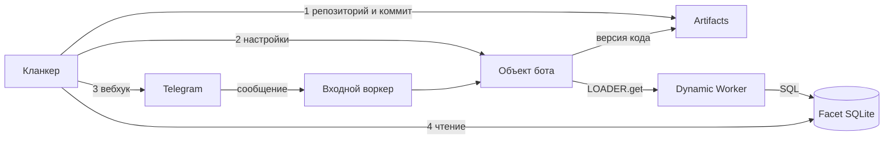

# Бот в телеграме силами кланкера на Cloudflare — механика

> Задача дословно: «зайти в кланкера и сказать “создай бота в телеграме, который я добавлю в рабочие
> чаты, и пускай он сохраняет каждое сообщение оттуда”». Бот развёрнут на Cloudflare под моим
> тенантом, всё создаётся, работает и проверяется через кланкера.
>
> **Правило: наш API в пути сообщения не участвует.** Ни строки в нашей базе, ни нашего сервиса
> между телеграмом и хранилищем. Кланкер работает инструментами Cloudflare и телеграма; для
> управления ему разрешён прозрачный прокси нашего API к API Cloudflare — но не свои маршруты:
> ни `v1/bots`, ни обёрток над ресурсами Cloudflare.
>
> Устройство взято с [Cloudflare VibeSDK](https://github.com/cloudflare/vibesdk): изоляция каждого
> проекта — свой Durable Object, хранение — изолированная база в Durable Object Facet, версии кода —
> Artifacts, исполнение — Dynamic Worker через Worker Loader. Дата: 2026-10-05.

## 0. Что здесь инвариант, а что решение

Разделение введено после того, как разбор одной ссылки дважды переписал документ целиком. Так быть не
должно: новая вводная меняет строку в таблице решений, а не весь план.

**Требования — не меняются, что бы ни попалось на глаза:**

| Требование | Откуда |
|---|---|
| Кланкер заводит бота сам; человек делает ровно одно нажатие | ботов создаёт только телеграм |
| Переписка не попадает ни в наше ядро, ни в нашу базу | снятие схемы 0.1 |
| Всё живёт в аккаунте Cloudflare | cloudflare-os, §11 |
| Сохраняется каждое сообщение | задача |
| Создание, работа и проверка — через кланкера | задача |
| В группе боту нужны права администратора; истории до входа нет | телеграм |

**Решения — меняются, если новая вводная выигрывает по измеряемой величине:**

| Что решаем | Выбрано | Почему | Отвергнуто |
|---|---|---|---|
| Где лежит переписка | SQLite в Durable Object Facet | изоляция по устройству, обычные запросы, 100 000 строк в день бесплатно | KV: 1 000 записей в день и лента перелистыванием ключей |
| Как исполняется код бота | Dynamic Worker через Worker Loader | деплоя на тенанта нет, версия кода = коммит | воркер тенанта в пространстве имён: $25/мес и заливка на каждого |
| Откуда версии и откат | Artifacts | коммиты, ветки, точки восстановления даром | своя копия прошлого файла |
| Где лежит код | репозиторий тенанта в Artifacts | git по HTTPS, пространства под тенантов | R2 или бандл — запасной путь, если Artifacts подведёт |
| Что платформенное | входной воркер и класс надзирателя, по одной штуке | иначе каждый кланкер тянет свою копию | — |
| Как кланкер распоряжается Cloudflare | прозрачный прокси в нашем API: вызов уходит как есть, ключ подставляем мы, ответ возвращаем как есть | прокси не надо чинить под каждое изменение API Cloudflare; он же место фильтра прав | свой маршрут `v1/bots` и обёртки над ресурсами Cloudflare: устанем поддерживать |
| Кто выписывает ботов в телеграме | мастер-бот платформы: заводится один раз, дальше выдаёт ботов по нажатию человека | человек не ходит к BotFather за каждым ботом; у платформы одна точка учёта ботов | каждый бот руками у BotFather: человек тратит шаг на каждого бота — оставлено запасным путём для стенда |
| Сколько живут сообщения | бессрочно: по расписанию не удаляем, удаление — только по требованию владельца | задача буквально требует сохранять каждое сообщение | срок хранения (год, три месяца): задача такого не просит |

Правило: измеряемые величины — изоляция, цена, что приходится деплоить, зрелость (GA или бета).
Выигрыша ни по одной — значит это вкус, и решение не меняется.

**Что взято из вчерашней карты, а чего в ней нет.** Форма приёма — оттуда: §5 говорит прямо «вебхук
тенанта — воркер; сообщения — D1 тенанта; один воркер может обслуживать N ботов по пути
`/hook/<секрет>`». Правила — тоже: §3 (одно пространство имён на всех, тенант = свои ресурсы, деплой
одним вызовом, никаких секретов в коде тенанта), §9 (ключ аккаунта не уходит агенту), §14 пункт 5
называет ровно этот прототип. Факты телеграма — §5. Чего в карте нет вовсе: Artifacts и Durable
Object Facets (в таблице §2 их не существует), а значит и сборки «чужой код со своими изолированными
данными»; про данные карта оставляет открытый вопрос (§15: D1 или Postgres + Hyperdrive). И одно
противоречие внутри карты ровно в нашем месте: §9 запрещает давать агенту ключ и говорит «кланкер
работает под нашими пропусками», а §11 обещает кланкеру инструмент «залить код». Требование
«кланкер делает всё сам и без нашего API» попадает в этот зазор — закрываем его прозрачным прокси
(§6): кланкер работает под нашим пропуском, но поверхностью Cloudflare.

## 1. Кто чем работает

| Кто | Чем | Что делает |
|---|---|---|
| Кланкер | прозрачный прокси нашего API к API Cloudflare (или MCP-сервер Cloudflare со своим ключом), git-протокол Artifacts, прямое HTTPS к `api.telegram.org` | заводит репозиторий и объект, коммитит код, ставит вебхук, читает сохранённое |
| Cloudflare | Workers, Durable Objects с SQLite, Facets, Worker Loader (Dynamic Workers), Artifacts, Workflows | исполняет чужой код в изоляции, хранит сообщения, хранит версии кода |
| Мы | Аккаунт, ключ Cloudflare, прокси к нему, один входной воркер, одно пространство имён объектов — всё заводится один раз | во время работы — ничего, кроме прокси для управления |

Кланкер работает поверхностью Cloudflare: по её API читает и пишет MCP-сервер, а деплой воркеров —
вообще только он ([cloudflare-os](cloudflare-os.md), §10). Доступ к API идёт через прозрачный прокси
(§6) — это не посредник в работе бота, а труба с нашим ключом: в пути сообщения нас нет.

## 2. Устройство одного бота — изоляция по построению

| Объект | Что это | Чей |
|---|---|---|
| Входной воркер `tg.<зона>`, путь `/b/<бот>` | принимает вебхук и отдаёт его объекту бота | платформа, заведён один раз на всех |
| Durable Object бота (надзиратель) | рабочая область: настройки, номер версии кода, список чатов; своя база | бот; создаётся по имени, деплоить нечего |
| Facet — объект, поднятый из динамического класса | **своя изолированная база SQLite** под архив сообщений | бот |
| Репозиторий Artifacts `bot-<тенант>` | код бота, коммиты, ветки, точки восстановления | тенант |
| Dynamic Worker | код бота, поднятый на время запроса по номеру версии | тенант; пишет кланкер |
| Бот телеграма | имя, аватар, токен | тенант |

Свойства, ради которых так:

- **Ничего общего между ботами.** У каждого свой объект, своя база, своя память. Общего — только
  входной воркер и пространство имён, и то и другое не хранит данных тенанта.
- **Динамический код не видит лишнего.** Facet даёт ему собственную базу; базу надзирателя он прочитать
  не может ([facets](https://developers.cloudflare.com/dynamic-workers/usage/durable-object-facets/)).
- **Деплоить на тенанта нечего.** Объект создаётся по имени при первом обращении. «Развернуть бота» =
  коммит в репозиторий и новый номер версии.
- **Токен бота код не видит.** Исходящие перехватывает надзиратель: пропускает только
  `api.telegram.org` и подставляет токен сам ([egress control](https://developers.cloudflare.com/dynamic-workers/usage/egress-control/)).

## 3. Заведение — шаги кланкера

**1. Код.** Кланкер заводит в Artifacts репозиторий `bot-<тенант>`, коммитит туда свой шаблон
обработчика и получает номер версии (он же — метка коммита). Artifacts говорит на обычном git по
HTTPS, а его пространства задуманы как раз под тенантов
([Artifacts](https://developers.cloudflare.com/artifacts/concepts/namespaces/)).

**2. Настройки.** Одним вызовом кланкер пишет в объект бота: имя, чаты, номер версии кода и секрет
вебхука. Объект адресуется по имени: `env.BOT.getByName("bot-<тенант>")`.

**3. Вебхук.** Кланкер ставит `setWebhook https://tg.<зона>/b/<бот>` с `secret_token`. Проверка —
`getWebhookInfo` показывает тот же адрес.

**4. Проверка.** Сообщение в чате → строка в базе фасета.

## 4. Приём сообщения

1. Телеграм шлёт обновление на входной воркер.
2. Входной воркер берёт объект бота по имени и передаёт запрос ему.
3. Надзиратель сверяет секрет, берёт номер версии кода и поднимает код:
   `env.LOADER.get("bot:<бот>:<коммит>", читатьИзArtifacts)`. Номер версии — коммит, поэтому один и
   тот же код переиспользует тёплый изолят, а правка кода даёт новый номер
   ([api reference](https://developers.cloudflare.com/dynamic-workers/api-reference/)).
4. Код кладёт запись в свою базу обычным SQL и отвечает 200.
5. Повтор доставки спотыкается о первичный ключ `(чат, номер сообщения)` — дубля нет.

Запись одна на сообщение: чат, автор, вид, текст, номер файла, время. Вид говорит, что это — текст,
фото, стикер; текст может быть пустым. **Каждое сообщение — строка**, файлы не скачиваем.

## 5. Чтение, надзор и выключение — тоже кланкером

| Что | Чем |
|---|---|
| Лента чата | SQL к базе фасета: «последние 20 по чату» — не перелистывание ключей |
| Смена кода | коммит в репозиторий и новый номер версии; откат — точка восстановления, история не переписывается |
| Потолки | custom limits на динамический воркер: CPU и подзапросы |
| Выключение | снять вебхук, удалить объект вместе с его базой |
| Срок хранения | бессрочно (решено 2026-10-05): по расписанию строки не удаляются; удаляются только по требованию владельца — то есть вместе с объектом |
| Отчёт по расписанию | события репозитория умеют запускать Workflow, а тот — сборку и рассылку ([build & deploy](https://developers.cloudflare.com/artifacts/guides/build-and-deploy-on-push/)) |
| Посмотреть глазами | Data Studio в панели Cloudflare показывает данные объекта |

## 6. Права: чем кланкеру разрешено

Жёсткий факт из [cloudflare-os](cloudflare-os.md), §9: **ключ аккаунта Cloudflare нельзя сузить до
одного тенанта или пространства имён** — такого разрешения у Cloudflare нет.

Решение: **наш API работает прозрачным прокси к API Cloudflare.** Кланкер шлёт вызов как есть — путь,
метод, заголовки, тело; мы подставляем ключ аккаунта и возвращаем ответ как есть, ничего не разбирая и
не переписывая. Так кланкер работает под нашим пропуском (правило карты, §9) и при этом поверхностью
Cloudflare (её обещание, §11), а мы не заводим ни одного своего описания чужих ресурсов: обёртки
отстают от API Cloudflare, прокси — нет.

| Путь | Как | Когда |
|---|---|---|
| **Прозрачный прокси** (по умолчанию) | Вызов кланкера → наш API → API Cloudflare; ключ подставляем мы | Всегда; здесь же и фильтр прав |
| **Свой ключ у кланкера** | Кланкер ходит в Cloudflare напрямую, в том числе в MCP-сервер | Если прокси мешает: потоковая работа, MCP, стенд |
| **Аккаунт тенанта** | У компании свой аккаунт Cloudflare, ключ её | Когда клиент требует своей изоляции и своего счёта |

Фильтр прав живёт в прокси и работает **по пути**: область продуктов (воркеры, объекты, Artifacts) и
имена ресурсов (`bot-<тенант>-*`). По тегам фильтровать нельзя — теги лежат в теле заливки, а прокси в
тело не смотрит; смотреть в тело значит писать разбор чужого формата, то есть ту самую обёртку.
Ключ аккаунта не уходит ни кланкеру, ни тенанту.

## 7. Телеграм: что неизбежно

Проверено по документации телеграма 2026-10-05:

- **Ботов создаёт только телеграм, а заводит их мастер-бот платформы** (решено 2026-10-05). Мастер-бот
  стоит под нашим аккаунтом; он даёт человеку ссылку, человек нажимает, мастер получает `managed_bot` и
  забирает токен методом `getManagedBotToken`. **Клик человека остаётся всегда** — кланкер делает его
  одноразовым, но не отменяет. Рабочий мастер-бот заведён 2026-10-05; его токен лежит вне репозитория,
  в хранилище секретов, и ни в код, ни в документы не попадает.
- **В группе бот видит всё только администратором.** Иначе приходят лишь обращения к нему.
- **Истории до входа нет.** Считаем с момента добавления — так и надо сказать человеку.
- Мастер-бот — единственный телеграмный объект платформы, и он только выписывает ботов: сообщения через
  него не идут. Путь не единственный: для стенда бот заводится руками у BotFather, а токен отдаётся
  кланкеру — тогда на нашей стороне от телеграма нет вообще ничего. Что бы ни выбрали, тенант получает
  своего отдельного бота: один бот на все тенанты не сходится ни с изоляцией, ни с учётом.

## 8. Цена

| Что | Включено | Дальше |
|---|---|---|
| Workers Paid — **обязателен**: Dynamic Workers только на платном плане | $5/мес | — |
| Dynamic Workers | 1 000 уникальных воркеров в месяц, 10 млн запросов, 30 млн CPU-мс | $0.002 за воркер в день |
| Durable Objects (SQLite) | бесплатный план: 100 000 запросов, 13 000 ГБ-с и 100 000 записей строк в день, 5 ГБ всего; платный: 400 000 ГБ-с, 50 млн записей строк, 5 ГБ в месяц | $12.50 за млн ГБ-с, $1 за млн строк, $0.20/ГБ-мес |
| Artifacts | 1 ГБ в месяц | $0.15 за 1 000 действий |
| Telegram | $0 | — |

**Пол — $5/мес**, а не $30: пространство имён Workers for Platforms не нужно вовсе. Тысяча записей в
день, которая убивала план на KV, здесь превращается в сто тысяч строк в день — бесплатно.

## 9. Риски

| Риск | Что делать |
|---|---|
| Dynamic Workers — платный план обязателен, и по нашей карте это открытая бета | Проверить живость на стенде M0; запасной путь для кода — обычный воркер + объект, если бета подведёт |
| Счёт идёт по паре «номер и код» | Номер версии = метка коммита; тот же код — тот же номер, тёплый изолят |
| Исходящие перехватывает надзиратель | Заблокировать всё — бот не сможет отвечать; пропускать ровно `api.telegram.org` и подставлять токен |
| Facet хранится вместе с объектом | Место считается один раз, но растёт вместе с архивом; хранение бессрочно, поэтому потолок базы объекта (по документации 10 ГБ) когда-то станет пределом — тогда старое выносим в R2 |
| Artifacts молодой (доки октября 2026) | Запасной путь для кода — R2 или бандл рядом с объектом |
| Входной воркер — платформенный, один на всех | Он в пути каждого сообщения: упал вход — встал приём. Объекты и данные живут |
| Ключ аккаунта не сужается до тенанта | Фильтр в прокси по области продуктов и именам ресурсов; теги фильтровать нельзя — они в теле заливки |
| Прокси — единственная точка отказа управления | Сообщения через него не идут: упал прокси — кланкер не управляет, приём и запись продолжаются |
| В группе без админки видно только обращения | В инструкции человеку: добавить администратором |
| Истории до входа нет | Считать с момента добавления |
| Запись видна сразу только в своём узле, до 60 с в остальных | Проверять ленту с запасом в минуту |
| Правки и удаления не собираем | Первая версия — только новые сообщения |

## 10. Порядок работы и чем проверяем

**M0. Полигон.** Аккаунт, входной воркер, пространство имён объектов, класс надзирателя, привязка
Worker Loader. Проверка: запрос на `/b/тест` доходит до объекта и возвращает понятный отказ.

**M1. Один бот руками.** Репозиторий в Artifacts с кодом, коммит, настройки в объекте, бот у BotFather,
вебхук. Проверка: написал в чате — строка в базе фасета, текст верный; SQL-запрос достаёт её обратно.

**M2. То же кланкером через MCP.** Четыре шага §3 без рук, кроме нажатия создания бота. Проверка:
после них сообщение в чате ложится в базу, и кланкер сам это показывает.

**M3. Надзор.** Лента запросом, правка кода коммитом, откат точкой восстановления, выключение.
Проверка: после отката работает прошлая версия; после выключения вебхук снят и записей нет.

**M4. Приёмка задачи.** Фраза кланкеру → одно нажатие → добавление бота в рабочий чат → сообщение →
кланкер читает его обратно. Без единой команды с моей стороны.

## 11. Решено молча и что открыто

Решено:

- Устройство — по образцу VibeSDK: объект на бота, изолированная база фасета под сообщения, Artifacts
  под код и историю, Worker Loader под исполнение.
- Сообщения живут в SQLite фасета, а не в KV: запросы вместо перелистывания, сто тысяч строк в день
  вместо тысячи.
- Токен бота подставляет надзиратель при исходящем вызове; код тенанта токена не видит.
- Входной воркер и класс надзирателя — платформенные, заведены один раз; деплоя на тенанта нет.
- Наш API в пути сообщения не участвует; прозрачный прокси к API Cloudflare для управления — можно,
  свои маршруты и обёртки над чужими ресурсами — нет.
- Из VibeSDK берём только устройство изоляции. Think, AI Gateway и агентский раздел Cloudflare не
  используем: у нас свои кланкеры и свой путь моделей.
- Файлы не скачиваем, правки не отслеживаем.
- Ботов в телеграме выписывает мастер-бот платформы: один раз заведён под нашим аккаунтом, дальше даёт
  человеку одну кнопку на бота (решено 2026-10-05). Запасной путь для стенда — бот руками у BotFather.
- Сообщения хранятся бессрочно; удаление — только по требованию владельца (решено 2026-10-05).

Открыто:

1. Признаки фильтра в прокси (§6): какие области продуктов и какие имена ресурсов разрешены кланкеру.

Следующий шаг: M0 и M1 — входной воркер, объект с фасетом, один воркер, один бот руками, одно
сообщение в базе. Это один день и проверяет всю механику.

## Источники

- Образец: [cloudflare/vibesdk](https://github.com/cloudflare/vibesdk) — устройство и разделение ролей.
- Cloudflare: [Durable Object Facets](https://developers.cloudflare.com/dynamic-workers/usage/durable-object-facets/), [перехват исходящих](https://developers.cloudflare.com/dynamic-workers/usage/egress-control/), [цена Dynamic Workers](https://developers.cloudflare.com/dynamic-workers/pricing/), [Worker Loader](https://developers.cloudflare.com/dynamic-workers/api-reference/), [объекты по имени](https://developers.cloudflare.com/durable-objects/api/namespace/), [цена и пределы объектов](https://developers.cloudflare.com/durable-objects/platform/pricing/), [Artifacts: пространства](https://developers.cloudflare.com/artifacts/concepts/namespaces/), [Artifacts: цена](https://developers.cloudflare.com/artifacts/platform/pricing/), [сборка и деплой из репозитория](https://developers.cloudflare.com/artifacts/guides/build-and-deploy-on-push/).
- Telegram: [managed bots](https://core.telegram.org/bots/features#managed-bots), [Bot API](https://core.telegram.org/bots/api), [privacy mode](https://core.telegram.org/bots/features#privacy-mode), [faq](https://core.telegram.org/bots/faq).
- Наш контекст: [cloudflare-os.md](cloudflare-os.md) — полигон, правила, права, цена.
