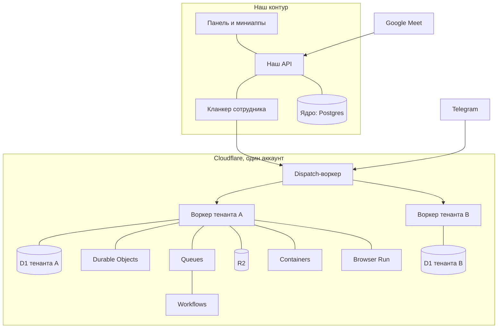

# ОС для бизнеса на Cloudflare — физибилити

> Салфетка. Дата: 2026-10-04. Факты проверены по официальным документам и блогам Cloudflare, Telegram и Google; ссылки по тексту. Это не план работ, а ответ на вопрос: тянет ли Cloudflare роль «полигона исполнения» для кланкеров сотрудников.

## 1. Короткий ответ

| Вопрос | Вердикт | Главная оговорка |
|---|---|---|
| Деплой и исполнение кода, который пишет агент | Да | Workers for Platforms + Dynamic Workers + Containers закрывают все три скорости: короткий код, Linux-задача, живой сервис |
| 1. Рабочие телеграм-чаты → отчёт руководителю | Да, с оговорками | Бот видит только сообщения после входа в чат; истории до входа не существует; боту нужны права администратора |
| 2. Реалтайм-миниапп от кланкера | Да | Реалтайм — Durable Object; авторизация — наш токен (Access удобен для людей, но его политика на уровне воркера ломает вебсокеты) |
| 3. Пятничный Google Meet → план-факт | Да, при Google Workspace | Транскрипт должен быть включён до конца встречи; иначе — бот-рекордер (Recall.ai) |
| 4. Дарк-китчен целиком | Да | PDF — Browser Run; Excel — SheetJS CE; ExcelJS на воркерах не подтверждён; тяжёлые файлы — контейнер |

Одной строкой: **Cloudflare годится как полигон. Ядро (наша база, вход, петля агента) остаётся у нас; CF берёт деплой, данные тенанта, очереди, процессы, файлы, документы и коннекторы.**

## 2. Примитивы платформы (карта)

Цены — уровень Pay-as-you-go; базовый план Workers — $5/мес, Workers for Platforms — отдельный план $25/мес ([pricing](https://developers.cloudflare.com/cloudflare-for-platforms/workers-for-platforms/reference/pricing/)).

| Продукт | Роль | Статус | Ключевые пределы | Цена |
|---|---|---|---|---|
| Workers | Исполнение JS/WASM | GA | CPU 30 с (макс 5 мин), память 128 МБ, 500 скриптов, подзапросы 10 000 ([limits](https://developers.cloudflare.com/workers/platform/limits/)) | $0.30/M запросов, $0.02/M CPU-мс |
| Workers for Platforms (WfP) | Полигон: скрипты тенантов | GA | Один dispatch-namespace на всех; постепенного выката нет — замена атомарная; лимиты CPU и подзапросов на запрос ([limits](https://developers.cloudflare.com/cloudflare-for-platforms/workers-for-platforms/reference/limits/)) | $25/мес: 20M запросов, 60M CPU-мс, 1000 скриптов; пример 100M запросов — $71.80 |
| Dynamic Workers | Код агента внутри запроса | Открытая бета (2026-03-24) | `LOADER.load/get`, модули JS/Python/WASM, сеть выключается, свои лимиты CPU ([docs](https://developers.cloudflare.com/dynamic-workers/)) | 1000 уникальных/мес, далее $0.002/сутки; 10M запросов, 30M CPU-мс |
| Containers | Linux-задача: npm, компиляторы, LibreOffice | GA (2026-04-13) | Микросервис-виртуалка 1/16–4 vCPU, до 12 ГиБ; старт 1–3 с; диск эфемерный ([docs](https://developers.cloudflare.com/containers/)) | $0.0000025/ГиБ-с память, $0.000020/vCPU-с, $0.00000007/ГБ-с диск |
| Sandbox SDK | Песочница для агента | GA | Два движка: контейнер и динамический воркер ([docs](https://developers.cloudflare.com/sandbox/)) | По движку |
| Agents SDK | Агенты, живущие на CF | 0.26.0, до 1.0 | Состояние 1 ГБ на агента, CPU 30 с на сообщение; только на CF ([limits](https://developers.cloudflare.com/agents/platform/limits/)) | DO-тариф |
| D1 | База на тенанта | GA | 10 ГБ на базу — потолок, не поднять; один писатель; реплики — бета ([limits](https://developers.cloudflare.com/d1/platform/limits/)) | Чтение $0.001/M строк, запись $1/M, диск $0.75/ГБ-мес |
| Durable Objects (SQLite) | Транзакции, реалтайм, будильники | GA | 10 ГБ на объект; ~1000 запросов/с; полные транзакции ([limits](https://developers.cloudflare.com/durable-objects/platform/limits/)) | $0.15/M запросов + $12.50/M ГиБ-с + $0.20/ГБ-мес |
| KV | Быстрые значения | GA | Значение 25 МиБ; 1 запись/с на ключ | $0.50/M чтений, $5/M записей |
| R2 | Файлы | GA | Объект до 5 ТиБ; S3-совместим; выдача бесплатна; версий нет ([pricing](https://developers.cloudflare.com/r2/pricing/)) | $0.015/ГБ-мес, $4.50/M записей, $0.36/M чтений |
| Queues | Очередь событий | GA | 128 КБ сообщение; 5000/с на очередь; до 14 дней хранения | $0.40/M операций |
| Workflows | Долгие процессы | GA | 10 000 шагов; сон до 365 дней; 50 000 параллельных ([limits](https://developers.cloudflare.com/workflows/platform/limits/)) | $0.30/M запусков, шаги $0.80/100k, состояние $0.20/ГБ-мес |
| Hyperdrive | Внешняя Postgres | GA | Кэш не сбрасывается на запись; 25 конфигов ([docs](https://developers.cloudflare.com/hyperdrive/)) | $0 |
| Vectorize | Векторы | GA | 20M векторов на индекс | $0.01/M измерений |
| Browser Run | PDF, скриншоты, разбор страниц | GA | HTML→PDF до 50 МБ; свои шрифты ([pdf](https://developers.cloudflare.com/browser-run/quick-actions/pdf-endpoint/)) | 10 ч/мес включено, далее $0.09/ч |
| Email | Входящая и исходящая почта | GA; отправка — бета | Входящее 25 МиБ | Роутинг бесплатно |
| Secrets Store | Секреты уровня аккаунта | Открытая бета | Только Workers и AI Gateway | Цены нет [не проверено] |
| Access | Вход для людей | GA | Вебсокеты ломаются на политике уровня воркера ([docs](https://developers.cloudflare.com/workers/configuration/cloudflare-access/)) | $0 или $7/пользователя-мес |

## 3. Полигон на салфетке

Правила полигона:

1. **Один аккаунт, один namespace `production` и один `staging`.** Документация прямо говорит: не заводить namespace на клиента. Изоляция — режимом недоверия и отдельными ресурсами, не числом namespace ([how it works](https://developers.cloudflare.com/cloudflare-for-platforms/workers-for-platforms/how-workers-for-platforms-works/)).
2. **Тенант = набор своих ресурсов:** своя D1, свой namespace Durable Objects, свой префикс в R2, свой namespace KV; они привязываются к воркеру тенанта при заливке.
3. **Деплой — один вызов:** `PUT /accounts/{аккаунт}/workers/dispatch/namespaces/{ns}/scripts/{имя}`; привязки, теги и секреты — в `metadata`; теги `tenant:<id>`, `agent:<id>` уходят в аудит и метрики ([API](https://developers.cloudflare.com/api/resources/workers_for_platforms/subresources/dispatch/subresources/namespaces/subresources/scripts/methods/update/)).
4. **Никаких секретов в коде тенанта:** платформа передаёт возможности RPC-заглушками через `props`; данные и ключи остаются в dispatch-воркере ([dynamic dispatch](https://developers.cloudflare.com/cloudflare-for-platforms/workers-for-platforms/configuration/dynamic-dispatch/)).
5. **Весь исходящий трафик тенанта — через общий Outbound Worker:** белые списки по имени хоста, журнал, подстановка ключей. Побочный эффект: сырые TCP-сокеты у тенантов отключаются — это и хорошо ([outbound workers](https://developers.cloudflare.com/cloudflare-for-platforms/workers-for-platforms/configuration/outbound-workers/)).
6. **На каждый запрос — потолок:** `dispatcher.get(name, {}, { limits: { cpuMs, subRequests } })`. Защита от «кошелька» ([custom limits](https://developers.cloudflare.com/cloudflare-for-platforms/workers-for-platforms/configuration/custom-limits/)).

## 4. Механика: где агент исполняет код

Три режима, выбор по задаче.

1. **Код внутри запроса (Dynamic Workers).** Агент пишет код, платформа грузит его в свежий изолят на время запроса. По умолчанию сети нет вообще (`globalOutbound: null`) — ни утечь, ни позвонить. Результат возвращается через журнал. Это и есть паттерн Code Mode: вместо сотен описаний инструментов модель пишет программу против типизированного API. Экономия на описаниях — до 99.9% входных токенов (1 100 против 1 170 000 для API Cloudflare). Статус: динамические воркеры — открытая бета, Code Mode в доках помечен экспериментальным ([Code Mode](https://developers.cloudflare.com/agents/tools/codemode/), [blog](https://blog.cloudflare.com/code-mode-mcp/)).
2. **Linux-задача (Containers и Sandbox SDK).** Когда агенту нужен настоящий Linux — `npm test`, компилятор, LibreOffice, долгий процесс. Контейнер запускается воркером через Durable Object, старт 1–3 с, диск эфемерный. Контейнеры — GA; именно этот путь Cloudflare в 2026 перестроил под агентские песочницы ([blog](https://blog.cloudflare.com/faster-agent-sandboxes/)).
3. **Живой сервис или миниапп (Workers for Platforms).** Агент собрал приложение — оно публикуется скриптом в namespace тенанта и живёт по своему адресу. Постепенного выката у скриптов тенантов нет: каждая заливка — атомарная замена; откат — перезаливка прошлой версии.

Плюс четвёртый слой — **процессы (Workflows):** «собрать данные к пятнице, дождаться подтверждения, разослать» живёт как долгий процесс с шагами, повторами, сном до года и ожиданием события; запускается по расписанию. Workflows нельзя положить в namespace тенанта — они живут в родительском аккаунте, а тенантская логика их дёргает ([limits](https://developers.cloudflare.com/workflows/platform/limits/)).

## 5. Кейс 1: телеграм-чаты → отчёт руководителю

> Снято 2026-10-05. В своё ядро телеграм не возим: бота заводит сам кланкер, данные лежат там,
> где он выберет. Разбор ниже — про возможности платформы, а не про наш план. См. `bot-on-cloudflare.md`.

Что требуется от тенанта: добавить бота в рабочий чат и дать ему права администратора (или выключить приватный режим — тогда бота надо пере-добавить). Администратор видит все сообщения, обычный бот — только обращения к нему и ответы ([privacy mode](https://core.telegram.org/bots/features#privacy-mode)).

Жёсткие факты:

- **Истории до входа нет.** Метода чтения истории в Bot API не существует; бот получает только обновления после входа ([FAQ](https://core.telegram.org/bots/faq)). Отчёт строится с момента подключения — это надо честно сказать клиенту.
- **Правила Telegram.** Сбор «сверх необходимого» запрещён (§4.3 ToS), данные придётся удалять по требованию и шифровать (§4.2, §4.4) ([ToS](https://telegram.org/tos/bot-developers)).
- **Лимиты:** 1 сообщение/с в чат, 20 сообщений/минуту в группе, текст до 4096 символов, скачать файл до 20 МБ, залить до 50 МБ.
- **Ботов нельзя создавать API:** только BotFather. Но с Bot API 9.6 есть Managed Bots: менеджер-бот даёт человеку ссылку, человек кликает, а платформа дальше сама получает и хранит токен нового бота — выдача бота становится управляемой ([managed bots](https://core.telegram.org/bots/features#managed-bots)).

Как это ложится на CF: вебхук тенанта — воркер; сообщения — в D1 тенанта; отчёт — Workflow по крону; рассылка — тот же бот. Один воркер может обслуживать N ботов по пути `/hook/<секрет>`; секрет приходит заголовком.

## 6. Кейс 2: реалтайм-миниапп от кланкера

- Агент собирает React-приложение; публикация — та же заливка в namespace тенанта, статика кладётся штатной трёхшаговой сессией WfP. Ловушка: статика в namespace общая по хешу — хеш надо солить идентификатором тенанта ([static assets](https://developers.cloudflare.com/cloudflare-for-platforms/workers-for-platforms/configuration/static-assets/)).
- Реалтайм — Durable Object с вебсокетами; состояние переживает перезагрузку и засыпание.
- Вход — наш токен, который воркер тенанта проверяет на входе (`run_worker_first`, чтобы статика не отдалась раньше проверки). Cloudflare Access можно поставить сверху как грубый фильтр людей, но политику на уровне воркера включать нельзя: вебсокеты получают 403; нужен вход через имя хоста ([docs](https://developers.cloudflare.com/workers/configuration/cloudflare-access/)).
- Адрес миниаппа — свой суффикс и подстановочный домен, маршрутизация — dispatch-воркером по имени хоста.

## 7. Кейс 3: пятничный Google Meet → план-факт

- Встречу находит Calendar API. Транскрипт даёт Meet REST API v2 (`conferenceRecords.transcripts`) или тот же текст, приехавший документом в Drive организатора.
- **Условия жёсткие:** транскрипт должен быть включён до конца встречи (запись — отдельно и только на платных редакциях Workspace); файл появляется не сразу, состояния `STARTED → ENDED → FILE_GENERATED`; читать могут владелец или участник; записи транскрипта живут 30 дней ([artifacts](https://developers.google.com/workspace/meet/api/guides/artifacts)).
- Авторизация — только от имени пользователя; доменная делегация — только у администратора Workspace. Скоупы на Drive — «ограниченные»: хранение на наших серверах потянет проверку безопасности Google ([auth](https://developers.google.com/workspace/meet/api/guides/authenticate-authorize)).
- Событие «транскрипт готов» приходит через Workspace Events, а он шлёт в Pub/Sub — это ещё один движущийся узел с подписками на 4 часа — 7 дней ([events](https://developers.google.com/workspace/events)).
- Запасной путь для клиентов без Workspace или без транскрипции — бот-рекордер (Recall.ai): он реально входит во встречу и отдаёт текст; зависимость от настроек клиента исчезает, цена — бот виден в списке участников ([Recall](https://docs.recall.ai/docs/bot-overview)).

Итог: кейс делается, но это «да, если» — а не безусловное да.

## 8. Кейс 4: дарк-китчен по шагам

| Шаг | Где живёт | Примитив |
|---|---|---|
| Заказ свободным текстом в чате кухни | CF | Вебхук-воркер → очередь |
| Разбор в `{ title, quantity, unit }[]` и привязка к каталогу | CF | Модель + код; SGR-схема; поиск по каталогу |
| Заказ, PDF/Excel поставщику | CF | Таблица заказа в D1; документ — Browser Run или SheetJS; файл — в R2; отправка — `sendDocument` (до 50 МБ) |
| Приёмка: факт количества и цены, расхождения красным | CF | Миниапп (воркер тенанта) + наши токены |
| Запись факта и пересчёт склада | CF | Транзакция в Durable Object SQLite или в D1 |
| «Поставка принята/с расхождениями» в чат | CF | Тот же бот |
| Витрина: доступные блюда по остаткам | CF | Чтение из D1; рецепты — часть каталога; публичный сайт и мобильное приложение читают тот же API |

Иммутабельность предопределённых полей делается не запретами, а формой данных: строки заказа — только добавление; цены — версиями с датой действия; при отправке поставщику — снимок заказа навсегда. R2 умеет WORM-замки на файлы, если нужен «неперезаписываемый» документ ([bucket locks](https://developers.cloudflare.com/r2/buckets/bucket-locks/)).

Документы: PDF с кириллицей — Browser Run (HTML + свой шрифт), это официальный сценарий «инвойсы и отчёты»; Excel — SheetJS Community Edition, у него есть официальный пример запуска на Workers. ExcelJS на Workers не подтверждён — на нём процесс не строим. Тяжёлый редкий файл — контейнер с LibreOffice.

## 9. Права: сотрудник → кланкер → тенант

- **Один токен аккаунта (`cfat_…`) — только у нашей платформы.** Он и не может быть ограничен одним namespace: такого скоупа у Cloudflare нет. Значит, он не уходит ни тенанту, ни агенту ([permissions](https://developers.cloudflare.com/fundamentals/api/reference/permissions/)).
- **Тенант получает не токен, а возможности:** отдельные ресурсы и RPC-заглушки. Код тенанта физически не видит чужих данных: нет файловой системы, нет API аккаунта, только привязанные ресурсы ([security model](https://developers.cloudflare.com/workers/reference/security-model/)).
- **Кланкер сотрудника работает под нашими пропусками** (как в текущем ядре), а не под ключами Cloudflare. Права сотрудника — это фильтр в нашей платформе, который решает, какие инструменты и сущности ему доступны.
- **Аудит:** Logpush отдаёт по каждому вызову namespace, имя скрипта, теги (можно писать туда тенанта и агента), время CPU; журнал аккаунта хранит изменения 18 месяцев ([audit](https://developers.cloudflare.com/fundamentals/account/account-security/audit-logs/)). Дыра: чтения (GET) пока не аудируются.
- **Выключение тенанта** — флаг в нашем dispatch-воркере (403 до вызова), плюс удаление скриптов по тегу. Права на namespace у Cloudflare отозвать нельзя — их нет.

## 10. MCP и Code Mode: что это даёт

- `mcp.cloudflare.com/mcp` — сервер Code Mode над **всем** API Cloudflare: около 2500 endpoints, включая заливку воркеров. Агент с токеном может читать и писать, а не только читать. Без Code Mode тот же сервер объявляет 2500 инструментов (~244k токенов) — поэтому норма — `search/execute` ([repo](https://github.com/cloudflare/mcp)).
- Доменные серверы (`*.mcp.cloudflare.com`) — в основном чтение: документация, наблюдаемость, логи, радар. Исключения: Bindings умеет CRUD по KV/R2/D1 и SQL к D1; Container Sandbox умеет исполнять shell в эфемерном контейнере; Browser умеет снимать PDF и разбирать страницы. Деплоить воркеры умеет только общий сервер Code Mode.
- Слой оркестрации — MCP Server Portals (открытая бета): один адрес, политики доступа, журнал, урезанные каталоги инструментов, Code Mode ([portals](https://developers.cloudflare.com/cloudflare-one/access-controls/ai-controls/mcp-portals/)).
- Для продакшена правило простое: **чтение и ad-hoc — MCP; конвейер деплоя — REST** (заливка скриптов, создание баз, запуск процессов, события). Code Mode помечен экспериментальным, на нём не строим критичное.

## 11. Что это меняет в ss

- Миниаппы: спрайты → воркеры тенанта в общем namespace. Плюс: своя изоляция, лимиты на кошелёк, аудит по тегам.
- Данные тенанта: сейчас своя Postgres-база на арендатора. Вариант CF — D1 на тенанта (10 ГБ — кухне хватает с запасом; это и есть рекомендованный Cloudflare способ масштабирования). Если база уже есть — Hyperdrive к ней за $0. Это развилка, не замена ядра.
- Очередь и процессы: events внутри CF — Queues; «пятничные» процессы — Workflows; bunqueue в ядре можно не трогать.
- Почта: входящая — Email Routing, исходящая — Email Service (бета).
- Кланкер: остаётся нашим; получает инструменты «залить код», «исполнить код», «запустить процесс», а исполнение происходит на CF.

Ядро (Postgres, вход, беседы, права) остаётся у нас: Cloudflare — полигон, а не замена.

## 12. Стоимость пилота

Пол платформы: $5 (Workers) + $25 (WfP) = **$30/мес**. Дальше копеечные единицы: пример Cloudflare — $71.80/мес на 100M запросов и 1200 скриптов. D1 — запись $1/M строк (посылка кухни — десятки строк). R2 — $0.015/ГБ и нулевая выдача. Browser Run — 10 часов включено, документ занимает секунды. Контейнер — доли цента за vCPU-секунду. Access — $0 до планки или $7 за человека. **На пилоте из нескольких компаний инфраструктура CF — десятки долларов в месяц; основные деньги по-прежнему уходят модели, не платформе.**

## 13. Риски и ограничения

| Риск | Что делать |
|---|---|
| У скриптов тенантов нет постепенного выката — замена атомарная | Держать `staging`-namespace и перезаливку прошлой версии как откат |
| Токен аккаунта нельзя сузить до namespace | Токен живёт только в сервисе платформы; тенанты и агенты его не видят |
| Вебсокеты ломаются на политике Access уровня воркера | Ставить Access через имя хоста, а права сотрудника проверять своим токеном |
| Режим недоверия обязателен, Outbound Worker гасит сырые сокеты | Так и надо; задачи с сокетами — в контейнер |
| Статика в namespace общая по хешу | Солить хеш идентификатором тенанта |
| Meet: встреча не даст транскрипт, если он не включён | Спрашивать на подключении; запасной путь — бот-рекордер |
| Telegram: нет истории до входа и есть ToS | Говорить клиенту прямо; собирать минимум; условия хранения |
| ExcelJS и шрифты pdf-lib на Workers не подтверждены | Excel — SheetJS CE; PDF — Browser Run |
| Code Mode и Dynamic Workers — бета/эксперимент | Критичное — на REST; Code Mode — там, где сбой не страшен |
| 10 ГБ — потолок D1 и объекта DO | Разбивать по тенантам; крупным клиентам — Hyperdrive к Postgres |
| EU: у Queues нет юрисдикции, код воркеров лежит глобально, CLOUD Act не решается настройкой | Для строгих клиентов — отдельное юридическое решение, не галочка |
| Запись/чтение DO тарифицируются временем (128 МБ на объект) | Засыпание объектов и Workflows на долгие ожидания |

## 14. Что проверить прототипами

1. Один тенант: залить user worker через REST, привязать D1, открыть по имени хоста.
2. Миниапп: статика + проверка нашего токена + вебсокет через Durable Object.
3. Исполнение кода агентом: Dynamic Worker без сети, результат через журнал.
4. PDF с кириллицей (Browser Run) и xlsx (SheetJS CE) — оба рендера глазами.
5. Telegram: managed-бот, админ в группе, недельный отчёт процессом по крону.
6. Meet: авторизация, дождаться `FILE_GENERATED`, собрать план-факт и отправить в чат.
7. Права: выдать права на один воркер, лимиты CPU, белый список исходящих, выключение тенанта флагом.

## 15. Открытые решения

- Один общий бот на всех или managed-бот каждому тенанту?
- Данные тенанта: D1 или Postgres + Hyperdrive?
- Миниаппы: только WfP или часть оставить обычными воркерами?
- Процессы держать в родительском аккаунте CF или в нашем контуре?
- Ставить ли Cloudflare Access на витрины миниаппов или хватит нашего токена?

## 16. Полнота инвентаря: чего в таблице §2 нет

Таблица §2 собрана **по четырём случаям из §1**, а не проходом по каталогу платформы. Что нужно не
случаю, а другой постановке вопроса — «где живут версии кода, который пишет агент» и «как динамически
загруженный код получает изолированное хранилище», — в неё не попало. Дело не в датах: документация
Artifacts обновлялась 13 августа и 1 октября 2026, фасеты объектов — 21 апреля, всё это раньше
сентябрьского текста карты. Проверено 2026-10-05 по каталогу
(<https://developers.cloudflare.com/llms.txt>): платформенных и ИИ-разделов там около сорока, в
таблице §2 — восемнадцать.

**Нужное, чего в таблице нет:**

| Раздел | Зачем нам | Первое, что известно |
|---|---|---|
| [Artifacts](https://developers.cloudflare.com/artifacts/) | версии и откат кода, который пишет агент: git по HTTPS, пространства под тенантов | 1 ГБ/мес включено, $0.15 за 1000 действий, 2000 запросов/10 с на пространство, файл до 1 ГБ ([цена](https://developers.cloudflare.com/artifacts/platform/pricing/)) |
| Durable Object Facets | изолированная база под динамически загруженный код: надзиратель выдаёт фасету своё хранилище и не пускает в своё | это фича [Dynamic Workers](https://developers.cloudflare.com/dynamic-workers/usage/durable-object-facets/), не отдельный продукт — потому и не строка таблицы |
| [Перехват исходящих](https://developers.cloudflare.com/dynamic-workers/usage/egress-control/) | белый список и подстановка ключей для кода агента | `globalOutbound` в Worker Loader |
| [Cloudflare CLI](https://developers.cloudflare.com/cf/) | чем агент дёргает платформу из командной строки | строки нет; вопрос — нужен ли, если есть прокси |

**Агентский и модельный раздел Cloudflare нам не нужен:** кланкеры свои. Сюда попадают
[Agent Lee](https://developers.cloudflare.com/agent-lee/), [Agent Memory](https://developers.cloudflare.com/agent-memory/),
[Agents](https://developers.cloudflare.com/agents/) (в том числе Think), [AI Gateway](https://developers.cloudflare.com/ai-gateway/),
[AI Search](https://developers.cloudflare.com/ai-search/), [Web Search](https://developers.cloudflare.com/web-search/),
[Workers AI](https://developers.cloudflare.com/workers-ai/). Модели и петля агента живут у нас, платформа
даёт только исполнение и хранение. Строки в §2 им не нужны — и не потому, что «потом», а потому, что не наш слой.
[Wallets](https://developers.cloudflare.com/wallets/) понадобится, только если дойдём до платных действий агента.

Остальное из каталога — сети, защита, доставка медиа, биллинг и обвязка (`Pages`, `Images`, `Stream`,
`Realtime`, `MoQ`, `Zaraz`, `Basin*`, `Pulumi`, `Terraform`, `Tenant`, `Version Management` и прочее) —
для наших четырёх случаев не нужно. Это отмечается один раз и дальше не пересматривается.

**Правило на будущее:** §2 расширяется не «по случаю», а проходом по каталогу. Иначе пропуск
находится только тогда, когда на него укажет внешняя ссылка — и выглядит это как смена подхода.
Полный список каталога — в §17.

## 17. Каталог предложений платформы: полный список

Проход по каталогу платформы (<https://developers.cloudflare.com/llms.txt>, проверено 2026-10-05) даёт 103 раздела-предложения. Таблица §2 — выборка под четыре случая из §1. Здесь — всё остальное, чтобы пропуск находился проходом по каталогу, а не внешней ссылкой (§16).

Обозначения: «—» в столбцах «Зрелость», «Пределы», «Цена» значит: в документации у этого раздела числа или метки зрелости нет. Это не значит «бесплатно» и не значит «без лимита». Столбец «Источник» — страница, откуда взята строка; пределы и цена взяты оттуда же. Цены — в долларах США, как в документации; тарифы платформа меняет, перед решением сверять с первоисточником. Семейство получает отметку «наш слой» или «не наш слой» — по четырём случаям карты, а не по цене.

### 17.1 Исполнение и код (8)

Наш слой: здесь исполняется код агента и стоит наш API.

| Раздел | Название | Что это | Зрелость | Пределы | Цена | Источник |
|---|---|---|---|---|---|---|
| `workers` | Cloudflare Workers | Серверлесс-платформа для приложений на глобальной сети Cloudflare | — | 10 млн запросов/мес включено (Paid); 5 мин CPU/запрос; 10 000 подзапросов/запрос | $5/мес (Paid); далее $0.30 за млн запросов и $0.02 за млн CPU-мс | https://developers.cloudflare.com/workers/platform/pricing/index.md |
| `cloudflare-for-platforms` | Cloudflare for Platforms | Мультитенантная платформа: клиенты деплоят код на своих доменах | — | 1200 запросов/5 мин на токен Client API; 200 запросов/с на IP; 8 тегов на script | $25/мес; включено 20 млн запросов, 60 млн CPU-мс, 1000 скриптов; далее $0.30/млн запросов | https://developers.cloudflare.com/cloudflare-for-platforms/workers-for-platforms/reference/pricing/ |
| `dynamic-workers` | Dynamic Workers | Запуск изолированных Worker'ов на лету для кода, заданного в рантайме | — | 4 одновременных Dynamic Workers на запрос Worker; 10 на Durable Object | включено 1000 уникальных Dynamic Workers/мес, 10 млн запросов/мес, 30 млн CPU-мс/мес; далее $0.002 за DW в день | https://developers.cloudflare.com/dynamic-workers/pricing/ |
| `containers` | Containers | Serverless-контейнеры рядом с Workers для ресурсоёмких задач | — | макс 4 vCPU; 12 GiB памяти; 20 GB диска на инстанс | Workers Paid $5/мес: включено 25 GiB-часов памяти, 375 vCPU-минут, 200 GB-часов диска; далее $0.0000025/GiB-с памяти | https://developers.cloudflare.com/containers/platform/pricing/ |
| `sandbox` | Cloudflare Sandboxes | Изолированный запуск недоверенного кода в Linux и воркерах | — | 50 подзапросов/запрос (Free); 1000 подзапросов/запрос (Paid) | по тарифам Containers; Workers и Durable Objects оплачиваются отдельно | https://developers.cloudflare.com/sandbox/sdk/platform/limits/index.md |
| `pages` | Cloudflare Pages | Мгновенный деплой фуллстек-приложений в глобальную сеть | — | 500 сборок/мес (Free); 20 000 файлов на сайт; 25 MiB размер одного файла | статик-ассеты бесплатны и без лимита; Functions биллятся как запросы Workers | https://developers.cloudflare.com/pages/platform/limits/index.md |
| `cf` | Cloudflare CLI (cf) | Единый CLI для публичного API Cloudflare и проектов Workers | бета | не найдено | не найдено | https://developers.cloudflare.com/cf/ |
| `workers-vpc` | Cloudflare Workers VPC | Доступ воркеров к приватным сетям через туннель | бета | 1000 VPC-сервисов на аккаунт; стандартные лимиты Workers | бесплатно в открытой бете; стандартные тарифы Workers | https://developers.cloudflare.com/workers-vpc/platform/limits/index.md |

### 17.2 Данные и хранилище (14)

Наш слой: базы, файлы, очереди; здесь же версии кода агента (Artifacts).

| Раздел | Название | Что это | Зрелость | Пределы | Цена | Источник |
|---|---|---|---|---|---|---|
| `artifacts` | Artifacts | Хранилище и версионирование файловых артефактов с git-совместимым доступом | — | 1 GB на репозиторий; 32 MB на файл; 2 000 запросов/10 с | включено 10 000 операций и 1 GB-мес в месяц; далее $0.15 за 1 000 операций и $0.50 за GB-мес | https://developers.cloudflare.com/artifacts/platform/pricing/index.md |
| `basin` | Basin | Serverless-платформа аналитики: приём, таблицы Iceberg, распределённый SQL | — | не найдено | включено 50 GB SQL-трансформаций и 50 GB sink-доставки в месяц; далее $0.04/GB и $0.03–0.06/GB | https://developers.cloudflare.com/basin/platform/pricing/index.md |
| `basin-catalog` | Basin Catalog | Управляемый каталог Apache Iceberg прямо в бакетах R2 | GA | не найдено | включено 1 млн операций каталога и 10 GB compaction в месяц; далее $9.00 за млн операций и $0.005/GB | https://developers.cloudflare.com/basin-catalog/platform/pricing/index.md |
| `basin-pipelines` | Basin Pipelines | Приём и потоковая трансформация данных в R2 и Iceberg | GA | 20 потоков на аккаунт; 5 MB на запрос приёма; 1 GB/s приём на поток | включено 50 GB SQL-трансформаций и 50 GB sink-доставки в месяц; далее $0.04/GB и $0.03–0.06/GB | https://developers.cloudflare.com/basin-pipelines/platform/limits/index.md |
| `basin-sql` | Basin SQL | Serverless распределённый SQL-движок для аналитики по Iceberg-таблицам Basin Catalog | GA | только Parquet; read-only (нет INSERT/CREATE); now() квантуется до 10 мс | включено 10 GB/мес просканировано; далее $0.0025/GB; минимум 10 MB на запрос | https://developers.cloudflare.com/basin-sql/platform/pricing/ |
| `d1` | Cloudflare D1 | Управляемая serverless SQL-база с семантикой SQLite для Workers | — | 50 000 БД на аккаунт (Paid); 10 GB на БД; 30 с на SQL-запрос | включено 25 млрд строк чтения/мес, далее $0.001/млн; 5 GB хранения включено, далее $0.75/GB-мес | https://developers.cloudflare.com/d1/platform/pricing/ |
| `durable-objects` | Cloudflare Durable Objects | Stateful-примитив Worker с хранилищем и глобально уникальным именем | — | 10 GB на объект; 500 классов на аккаунт (Paid); 30 с CPU на запрос (до 5 мин) | включено 1 млн запросов/мес, далее $0.15/млн; 400 000 GB-с/мес, далее $12.50/млн GB-с | https://developers.cloudflare.com/durable-objects/platform/pricing/ |
| `hyperdrive` | Hyperdrive (Postgres & MySQL) | Пул соединений и кеш запросов к внешним Postgres/MySQL из Workers | — | 25 конфигураций БД на аккаунт (Paid); ~100 соединений к origin на конфигурацию; 60 с на запрос | включено в Workers Free/Paid; Free 100 000 запросов к БД/день; Paid без ограничений | https://developers.cloudflare.com/hyperdrive/platform/pricing/index.md |
| `k2` | K2 | Устойчивый журнал событий: продюсеры и независимые консьюмеры | бета | 10 GB хранения на аккаунт; 20 потоков на аккаунт; до 30 дней хранения | — | https://developers.cloudflare.com/k2/platform/limits/index.md |
| `kv` | Cloudflare Workers KV | Глобальное низколатентное key-value хранилище для Workers | — | 25 MiB размер значения; 512 байт размер ключа; 1 000 namespaces на аккаунт | включено 10 млн чтений/мес на Workers Paid; далее $0.50/млн чтений; $5.00/млн записей; $0.50/GB-мес | https://developers.cloudflare.com/kv/platform/pricing/index.md |
| `queues` | Cloudflare Queues | Очереди сообщений с гарантированной доставкой для Workers | — | 128 KB размер сообщения; 5 000 сообщений/с на очередь; 25 GB backlog на очередь | включено 1 000 000 операций/мес на Workers Paid; далее $0.40/млн операций | https://developers.cloudflare.com/queues/platform/pricing/index.md |
| `r2` | Cloudflare R2 | Объектное хранилище без платы за исходящий трафик | — | 5 TiB на объект; 1 000 000 buckets на аккаунт; 50 операций управления bucket/с | включено 10 GB-мес и 1 млн Class A/мес; далее $0.015/GB-мес; $4.50/млн Class A | https://developers.cloudflare.com/r2/pricing/index.md |
| `vectorize` | Cloudflare Vectorize | Глобальная векторная база данных для приложений на Workers | GA | 50 000 индексов/аккаунт (Paid); 20 000 000 векторов/индекс; 1536 измерений на вектор | включено 50 млн запрошенных измерений/мес (Paid); далее $0.01 за млн | https://developers.cloudflare.com/vectorize/platform/pricing/index.md |
| `workflows` | Cloudflare Workflows | Долговечные многошаговые приложения на Workers с сохранением состояния | — | 10 000 шагов на Workflow (Paid); 50 000 одновременных инстансов; payload 1 MiB | включено 10 млн запросов и 500 000 шагов/мес (Paid); далее $0.30/млн запросов, $0.80/100 000 шагов | https://developers.cloudflare.com/workflows/reference/pricing/index.md |

### 17.3 Связь и доставка (26)

Не наш слой: сеть и доставка для клиентов платформы.

| Раздел | Название | Что это | Зрелость | Пределы | Цена | Источник |
|---|---|---|---|---|---|---|
| `dns` | Cloudflare DNS | Авторитативный DNS-сервис на глобальной сети Cloudflare | — | — | включено во все планы | https://developers.cloudflare.com/dns/index.md |
| `cache` | Cloudflare Cache | Кэширование статического и динамического контента на edge-серверах | — | — | включено во все планы | https://developers.cloudflare.com/cache/index.md |
| `argo-smart-routing` | Argo Smart Routing | Маршрутизация трафика по быстрейшим сетевым путям | — | — | — | https://developers.cloudflare.com/argo-smart-routing/index.md |
| `automatic-platform-optimization` | Automatic Platform Optimization | Кэширование и отдача всего WordPress-сайта с edge-сети | — | — | — | https://developers.cloudflare.com/automatic-platform-optimization/index.md |
| `china-network` | Cloudflare China Network | Доставка контента в материковом Китае через ДЦ Cloudflare и JD Cloud | — | — | только Enterprise-план; отдельная подписка | https://developers.cloudflare.com/china-network/get-started/index.md |
| `load-balancing` | Cloudflare Load Balancing | Распределение трафика между origin-серверами | — | 20 балансировщиков; 20 пулов; 20 endpoints (не-Enterprise) | — | https://developers.cloudflare.com/load-balancing/reference/limitations/index.md |
| `health-checks` | Health Checks | Мониторинг доступности origin и уведомления об изменениях | — | текст ответа проверяется в первых 10 КБ | — | https://developers.cloudflare.com/health-checks/get-started/index.md |
| `smart-shield` | Cloudflare Smart Shield | Набор функций защиты origin и снижения нагрузки | — | — | бесплатный базовый пакет; платные пакеты с Argo и Advanced | https://developers.cloudflare.com/smart-shield/get-started/index.md |
| `spectrum` | Cloudflare Spectrum | Проксирование TCP/UDP-приложений с защитой от DDoS | — | 10 IPv4-хостов на аккаунт | платный аддон к Enterprise; Minecraft и SSH на Pro и выше | https://developers.cloudflare.com/spectrum/reference/limitations/index.md |
| `speed` | Speed | Тесты производительности сайта и рекомендации по оптимизации Cloudflare | — | — | включено во все планы | https://developers.cloudflare.com/speed/index.md |
| `waiting-room` | Waiting Room | Виртуальная очередь посетителей при пиковых нагрузках на сайт | — | 1 комната на Business/Enterprise (Enterprise: докупаются дополнительные) | включено 1 базовая комната в Business и Enterprise | https://developers.cloudflare.com/waiting-room/plans/index.md |
| `web3` | Web3 | Шлюзы к IPFS и Ethereum без своей инфраструктуры | — | 15 шлюзов; 50 ГБ трафика (IPFS, Free/Pro/Business); 500 000 HTTP-запросов (Ethereum) | включено 50 ГБ трафика и 500 000 запросов (Enterprise: 100 ГБ и 1 000 000); далее usage-based billing | https://developers.cloudflare.com/web3/reference/limits/index.md |
| `network` | Network settings | Управление сетевыми настройками сайта: gRPC, IPv6, WebSockets, IP-геолокация | — | не найдено | включено во все планы | https://developers.cloudflare.com/network/ |
| `magic-transit` | Cloudflare Magic Transit | DDoS-защита и ускорение трафика для своих сетей через BGP и GRE/IPsec | — | требуется префикс /24; альтернатива — Cloudflare IPs | только Enterprise; цена не указана | https://developers.cloudflare.com/magic-transit/index.md |
| `byoip` | Cloudflare BYOIP | Свои IP-префиксы с защитой и скоростью Cloudflare | — | не найдено | не найдено | https://developers.cloudflare.com/byoip/index.md |
| `network-interconnect` | Cloudflare Network Interconnect (CNI) | Приватное подключение своей сети к Cloudflare (Direct/Partner/Cloud) | — | до 10 Гбит/с Cloudflare→клиент (v1); MTU 1500 байт (v2); линии не длиннее 10 км | только Enterprise; цена не указана | https://developers.cloudflare.com/network-interconnect/get-started/index.md |
| `network-flow` | Network Flow (ранее Magic Network Monitoring) | Анализ трафика по NetFlow, sFlow, IPFIX и AWS VPC flow logs | — | 10 маршрутизаторов; 25 правил; 250 потоков/с на аккаунт (free) | включено на всех планах (free-версия для всех аккаунтов); цена Enterprise не указана | https://developers.cloudflare.com/network-flow/network-flow-free/index.md |
| `network-error-logging` | Network Error Logging (NEL) | Сбор браузерных отчётов о сетевых ошибках на последней миле | — | — | включено на Free и Pro планах; цена не указана | https://developers.cloudflare.com/network-error-logging/index.md |
| `mesh` | Cloudflare Mesh | Пост-квантовая приватная mesh-сеть для устройств и сервисов | бета | 50 нод на аккаунт; 1 000 CIDR-маршрутов на аккаунт; 1 000 маршрутов общих с Cloudflare Tunnel | не найдено | https://developers.cloudflare.com/cloudflare-one/account-limits/index.md |
| `multi-cloud-networking` | Cloudflare One Multi-Cloud Networking | Автообнаружение и связывание ресурсов публичных облаков | бета | не найдено | не найдено | https://developers.cloudflare.com/multi-cloud-networking/index.md |
| `cloudflare-wan` | Cloudflare WAN | Глобальная WAN вместо MPLS, туннели GRE/IPsec | — | не найдено | не найдено | https://developers.cloudflare.com/cloudflare-wan/index.md |
| `data-localization` | Data Localization Suite | Контроль регионов хранения ключей, логов и обработки | — | не найдено | не найдено (Enterprise-only paid add-on) | https://developers.cloudflare.com/data-localization/index.md |
| `tunnel` | Cloudflare Tunnel | Подключение origin-серверов к Cloudflare без публичных IP | — | 4 долгоживущих соединения на туннель к 2 дата-центрам | — | https://developers.cloudflare.com/tunnel/index.md |
| `warp-client` | Cloudflare WARP client | Шифрует трафик устройства и подключает его к Cloudflare | — | не найдено | — | https://developers.cloudflare.com/warp-client/index.md |
| `radar` | Cloudflare Radar | Данные Cloudflare о глобальном интернет-трафике, атаках и технологиях | — | не найдено | включено (API Radar бесплатен); далее — | https://developers.cloudflare.com/radar/index.md |
| `email-service` | Cloudflare Email Service | Отправка транзакционных писем и маршрутизация входящих в Workers | бета | 5 MiB размер сообщения; 50 получателей на письмо; 30 доменов на зону | включено 3 000 исходящих писем/мес на Workers Paid; далее $0.35 за 1 000 писем; входящие неограниченно | https://developers.cloudflare.com/email-service/platform/limits/index.md |

### 17.4 Защита и доступ (19)

Не наш слой для четырёх случаев; Turnstile, Secrets Store и Zero Trust могут понадобиться в продукте.

| Раздел | Название | Что это | Зрелость | Пределы | Цена | Источник |
|---|---|---|---|---|---|---|
| `ssl` | SSL/TLS | Сертификаты и шифрование трафика между посетителем, Cloudflare и origin-сервером | — | Universal SSL покрывает только apex и поддомены первого уровня | включено бесплатно (Universal SSL); далее платные сертификаты | https://developers.cloudflare.com/ssl/edge-certificates/universal-ssl/limitations/index.md |
| `waf` | Cloudflare Web Application Firewall | Защита веб- и API-трафика наборами правил | — | 1 правило rate limiting на Free; attack score с Business; Managed Rules на Free — только Free Managed Ruleset | не найдено | https://developers.cloudflare.com/waf/index.md |
| `bots` | Bot solutions | Выявление и блокировка автоматизированного трафика ботов на сайте | — | bot score 1–99 | Bot Fight Mode включён во все планы; Super Bot Fight Mode в Pro/Business/Enterprise; Bot Management for Enterprise — платный аддон Enterprise | https://developers.cloudflare.com/bots/index.md |
| `ddos-protection` | DDoS Protection | Автоматическая защита от DDoS-атак на уровнях 3–7 | — | — | включено на всех планах (L3–L7, без лимита трафика); Advanced DDoS Protection — платный аддон Enterprise | https://developers.cloudflare.com/ddos-protection/index.md |
| `api-shield` | API Shield | Обнаружение и защита API: схемы, mTLS, JWT, abuse detection | — | 10 000 сохранённых endpoints; 10 схем валидации; 10+ MiB суммарный размер схем (Enterprise с API Shield) | Enterprise-only платный аддон; цена по запросу у account team | https://developers.cloudflare.com/api-shield/plans/index.md |
| `turnstile` | Cloudflare Turnstile | CAPTCHA-альтернатива без капчи, приватная проверка людей | — | 20 виджетов на Free; 10 хостов на виджет на Free; 200 хостов на виджет на Enterprise | Free — бесплатно; Enterprise — Contact Sales | https://developers.cloudflare.com/turnstile/plans/index.md |
| `cloudflare-challenges` | Challenges | Проверка, что посетитель человек, через challenge-страницы | — | — | — | https://developers.cloudflare.com/cloudflare-challenges/index.md |
| `client-side-security` | Client-side security | Мониторинг и защита сторонних скриптов у посетителей | — | 5 правил content security (Advanced) | включено на всех планах; Client-Side Security Advanced — платный аддон | https://developers.cloudflare.com/client-side-security/index.md |
| `dmarc-management` | DMARC Management | Отслеживание отправителей писем и DMARC-отчётов для домена | — | 10 DNS-запросов на одну SPF-проверку (RFC 7208) | включено на всех планах с Cloudflare DNS | https://developers.cloudflare.com/dmarc-management/dns-lookup-limits/index.md |
| `firewall` | Firewall Rules | Правила проверки входящего HTTP-трафика (устарел, заменён WAF) | — | 5/20/100/1000 правил по планам Free/Pro/Business/Enterprise | включено на всех планах | https://developers.cloudflare.com/firewall/index.md |
| `key-transparency` | Key Transparency Auditor | Аудитор логов публичных ключей для E2EE-мессенджеров | — | не найдено | не найдено | https://developers.cloudflare.com/key-transparency/index.md |
| `security-center` | Cloudflare Security Center | Единая панель: инвентарь активов, угрозы, защита бренда | — | 100 вызовов API/мес; 2 500 вызовов/мес на Enterprise; 12 URL-сканов/с на Enterprise | не найдено | https://developers.cloudflare.com/security-center/intel-apis/limits/index.md |
| `secrets-store` | Cloudflare Secrets Store | Централизованное шифрованное хранилище секретов уровня аккаунта | бета | не найдено | не найдено | https://developers.cloudflare.com/secrets-store/index.md |
| `cloudflare-network-firewall` | Cloudflare Network Firewall | FWaaS-фильтрация пакетов L3/L4 в сети Cloudflare | — | изменения правил менее чем за 1 минуту | не найдено (включено при покупке Magic Transit или Cloudflare WAN) | https://developers.cloudflare.com/cloudflare-network-firewall/plans/index.md |
| `cloudflare-one` | Cloudflare One | SASE-платформа: Zero Trust, сеть и безопасность в одном | — | 500 приложений Access; 1 000 туннелей cloudflared; 500 DNS-политик Gateway | не найдено | https://developers.cloudflare.com/cloudflare-one/account-limits/index.md |
| `privacy-pass` | Privacy Pass | Криптотокены: доказать утверждение о пользователе без раскрытия личности | — | не найдено | — | https://developers.cloudflare.com/privacy-pass/index.md |
| `privacy-proxy` | Privacy Proxy | MASQUE-прокси, скрывающий IP клиента с сохранением геолокации | — | не найдено | — | https://developers.cloudflare.com/privacy-proxy/index.md |
| `ohttp-relay` | Cloudflare OHTTP Relay | Управляемый OHTTP-релей, скрывающий IP клиента от бэкенда | бета | не найдено | — | https://developers.cloudflare.com/ohttp-relay/ |
| `ai-crawl-control` | AI Crawl Control | Мониторинг и контроль доступа AI-сервисов к контенту сайта | — | не найдено | — | https://developers.cloudflare.com/ai-crawl-control/index.md |

### 17.5 ИИ и агенты (9)

Не наш слой: кланкеры, модели и петля агента свои (§16).

| Раздел | Название | Что это | Зрелость | Пределы | Цена | Источник |
|---|---|---|---|---|---|---|
| `agents` | Cloudflare Agents | Хостинг агентов с durable-состоянием, WebSocket и задачами по расписанию | — | 1 GB состояния на агент; 30 с CPU на агент; 10 MB на скрипт | — | https://developers.cloudflare.com/agents/platform/limits/index.md |
| `agent-memory` | Agent Memory | Постоянная память агентов: извлечение, классификация и припоминание знаний | бета | 500 сообщений на вызов ingest; 32 KB на сообщение; 1 KB на запрос recall | — (в private beta не биллят; уведомят минимум за 30 дней) | https://developers.cloudflare.com/agent-memory/platform/limits/index.md |
| `agent-lee` | Agent Lee | ИИ-ассистент в дашборде: вопросы, диагностика, изменения по аккаунту | бета | не найдено | — | https://developers.cloudflare.com/agent-lee/index.md |
| `ai` | Cloudflare AI | Платформа для запуска ИИ-моделей на инфраструктуре Cloudflare и через шлюз | — | не найдено | — | https://developers.cloudflare.com/ai/index.md |
| `ai-gateway` | AI Gateway | Шлюз ИИ-запросов: кэш, лимиты, аналитика, логирование, retry | — | 10 гейтвеев на аккаунт (free), 20 (paid); 25 MB кэшируемый запрос; 200 запросов/60 с при Unified Billing | включено бесплатно (аналитика, кэш, rate limiting); Unified Billing +5%; Logpush +$0.05 за млн запросов | https://developers.cloudflare.com/ai-gateway/reference/limits/index.md |
| `ai-search` | AI Search | Управляемый поиск и RAG по данным для приложений и агентов | — | 100 инстансов на аккаунт (free), 5 000 (paid); 100 000 файлов на инстанс; 10 MiB PDF с OCR | включено 5 млн токенов ingestion, 10 GB-мес, 1 000 semantic и 1 000 full-text запросов; далее $0.75 за млн токенов и $2.00 за GB-мес | https://developers.cloudflare.com/ai-search/platform/limits-pricing/index.md |
| `web-search` | Cloudflare Web Search API | Поиск в интернете для агентов через AI Gateway | превью | не найдено | Ceramic.ai $0.25 за 1000 запросов; Exa $7.00 за 1000; Linkup $5.00 за 1000 | https://developers.cloudflare.com/web-search/providers/index.md |
| `workers-ai` | Cloudflare Workers AI | Запуск ML-моделей на серверлесс-GPU Cloudflare | GA | 300 запросов/мин на генерацию текста; 20 запросов/мин на платные модели; 10 000 нейронов/день | включено 10 000 нейронов/день; далее $0.011 за 1000 нейронов | https://developers.cloudflare.com/workers-ai/platform/pricing/index.md |
| `browser-run` | Browser Run | Headless Chrome на сети Cloudflare: скрейпинг, скриншоты, PDF | — | Free 10 минут browser hours/день; Paid 10 часов/мес включено; 200 одновременных браузеров на аккаунт | включено 10 часов/мес; далее $0.09/час; +$2.00/доп. одновременный браузер | https://developers.cloudflare.com/browser-run/pricing/ |

### 17.6 Наблюдаемость, деньги, обвязка (19)

Обвязка: Tenant, Logs, Billing — то, чем мы управляем при заведении клиента.

| Раздел | Название | Что это | Зрелость | Пределы | Цена | Источник |
|---|---|---|---|---|---|---|
| `analytics` | Analytics | Метаданные и аналитика по продуктам Cloudflare | — | 300 GraphQL-запросов/5 мин на пользователя; до 10 зон на запрос; 1 аккаунт на запрос | включено 10 млн точек/мес и 1 млн чтений/мес (Workers Paid); далее $0.25/млн точек; $1.00/млн чтений | https://developers.cloudflare.com/analytics/graphql-api/limits/index.md |
| `web-analytics` | Cloudflare Web Analytics | Приватная аналитика посещаемости сайта без проксирования | — | 10 сайтов без прокси; 1000 сайтов параллельно в дашборде; 0–100 правил по плану | включено во все планы | https://developers.cloudflare.com/web-analytics/limits/index.md |
| `observability` | Cloudflare Observability | Инструменты наблюдаемости: логи, трейсы, ошибки | — | Free: 0.5 GB/день приёма; хранение 7 дней | включено Free 0.5 GB/день и 7 дней хранения; Paid 50 GB/цикл приёма и 12 GB-мес хранения; далее $0.25/GB приёма; $0.10/GB-мес хранения | https://developers.cloudflare.com/observability/pricing/index.md |
| `logs` | Cloudflare Logs | Детальные метаданные-логи продуктов Cloudflare | — | 25 GB/аккаунт выгрузки в месяц; 1 GB/аккаунт трансформаций в месяц | включено 25 GB/мес внутренне и 25 GB/мес наружу; далее $0.03/GB внутренне; $0.10/GB наружу; $0.04/GB трансформация | https://developers.cloudflare.com/logs/logpush/pricing/index.md |
| `log-explorer` | Log Explorer | Хранение и поиск логов Cloudflare в дашборде | — | хранение до 2 лет (по контракту) | $0.10 за GB/мес | https://developers.cloudflare.com/log-explorer/index.md |
| `billing` | Billing | Управление биллингом и подписками аккаунта Cloudflare | — | не найдено | — | https://developers.cloudflare.com/billing/index.md |
| `monetization-gateway` | Monetization Gateway | Оплата за защищённые ресурсы через протокол x402 | закрытая бета | не найдено | — | https://developers.cloudflare.com/monetization-gateway/index.md |
| `notifications` | Alerts | Оповещения по продуктам с доставкой в email, webhooks, PagerDuty | — | 100 вебхук-назначений на аккаунт без платной зоны; 20 email-получателей на алерт | включено во все планы (email, webhooks); PagerDuty с Business | https://developers.cloudflare.com/notifications/notification-available/ |
| `pulumi` | Pulumi | Управление ресурсами Cloudflare как инфраструктурой через Pulumi IaC | — | не найдено | бесплатно, open source (Apache 2.0); Pulumi Cloud — отдельно | https://developers.cloudflare.com/pulumi/installing/ |
| `terraform` | Terraform provider | Управление конфигурацией Cloudflare как код через Terraform | — | не найдено | не найдено | https://developers.cloudflare.com/terraform/ |
| `tenant` | Cloudflare Tenant | Провижининг аккаунтов и сервисов Cloudflare для партнёров | — | не найдено | не найдено | https://developers.cloudflare.com/tenant/reference/subscriptions/ |
| `version-management` | Cloudflare Version Management | Версионирование, стейджинг и откат конфигураций зоны Cloudflare | — | не найдено | — | https://developers.cloudflare.com/version-management/index.md |
| `time-services` | Time Services | Сервисы времени Cloudflare: NTP, NTS и Roughtime | — | не найдено | NTP бесплатно | https://developers.cloudflare.com/time-services/ntp/usage/ |
| `randomness-beacon` | Randomness Beacon (drand) | Распределённый маяк случайности drand с публично проверяемыми значениями | — | не найдено | не найдено | https://developers.cloudflare.com/randomness-beacon/ |
| `registrar` | Cloudflare Registrar | Покупка и продление доменов по себестоимости без наценки | — | не найдено | по цене реестра и ICANN, без наценки; .uk и .nz — трансфер без платы; возвратов нет | https://developers.cloudflare.com/registrar/faq/ |
| `fundamentals` | Cloudflare Fundamentals | Базовые концепции, настройка аккаунта и управление доменами | — | 1200 запросов/5 мин на пользователя; 200 запросов/с на IP; 50 токенов на пользователя | — | https://developers.cloudflare.com/fundamentals/api/reference/limits/index.md |
| `rules` | Cloudflare Rules | Изменение запросов, настроек и действий через правила | — | не найдено | включено во все планы | https://developers.cloudflare.com/rules/ |
| `ruleset-engine` | Ruleset Engine | Создание правил и наборов правил для продуктов Cloudflare | — | не найдено | не найдено | https://developers.cloudflare.com/ruleset-engine/ |
| `resource-tagging` | Resource Tagging | Ключ-значение теги на ресурсах для организации, доступа, биллинга | бета | 10 000 тегов на аккаунт; 256 символов на ключ; 100 результатов на страницу | включено во все планы | https://developers.cloudflare.com/resource-tagging/reference/limits/ |

### 17.7 Медиа (4)

Не наш слой.

| Раздел | Название | Что это | Зрелость | Пределы | Цена | Источник |
|---|---|---|---|---|---|---|
| `stream` | Cloudflare Stream | Хранение, кодирование и глобальная доставка видео | — | базовая загрузка до 200 МБ; максимальный файл 30 ГБ; web-сегмент 4 с | хранилище $5/мес за 1000 минут; доставка $1 за 1000 минут | https://developers.cloudflare.com/stream/pricing/index.md |
| `images` | Cloudflare Images | Платформа трансформации, хранения и доставки изображений на edge | — | remote-файл 100 MB; hosted-файл 10 MB; площадь 100 MP | Free 5000 уникальных трансформаций/мес; далее $0.50/1000; хранение $5/100 000 изображений/мес | https://developers.cloudflare.com/images/pricing/ |
| `realtime` | Cloudflare Realtime | Платформа WebRTC для звонков, SFU и TURN | — | 50 API-запросов/с на сессию; 64 трека за запрос; таймаут медиа 30 с | включено 1000 ГБ/мес; далее $0.05 за ГБ egress (SFU и TURN) | https://developers.cloudflare.com/realtime/sfu/platform/pricing/index.md |
| `moq` | Media over QUIC (MoQ) | Протокол доставки живого медиа поверх QUIC | бета | не найдено | бесплатно в период беты | https://developers.cloudflare.com/moq/index.md |

### 17.8 Прочее (4)

Не наш слой; Wallets — только при платных действиях агента.

| Раздел | Название | Что это | Зрелость | Пределы | Цена | Источник |
|---|---|---|---|---|---|---|
| `flagship` | Cloudflare Flagship | Сервис фича-флагов: управление видимостью функций без передеплоя | — | 10 000 приложений на аккаунт; 5 000 флагов на приложение; глубина условий 5 уровней | — | https://developers.cloudflare.com/flagship/reference/limits/index.md |
| `wallets` | Cloudflare Wallets | Программируемый кошелёк и стабильная идентичность для аккаунтов и AI-агентов | — | не найдено | не найдено | https://developers.cloudflare.com/wallets/ |
| `zaraz` | Cloudflare Zaraz | Вынос сторонних скриптов и аналитики на периферию | — | 1 000 000 событий/мес бесплатно; отключение при превышении без оплаты | включено 1 000 000 событий/мес; далее $5/мес за 1 000 000 событий | https://developers.cloudflare.com/zaraz/pricing-info/index.md |
| `google-tag-gateway` | Google tag gateway for advertisers | Раздача тегов Google со своего домена для восстановления рекламных сигналов | — | — | бесплатно; запросы через шлюз не тарифицируются в CDN, WAF и Bot Management | https://developers.cloudflare.com/google-tag-gateway/index.md |

Следующий шаг: собрать стенд из пункта 14.1–14.3 — один тенант, один миниапп, одно исполнение кода агента. Это три дня и наименьшая цена проверки всей ставки.

## Основные источники

- Cloudflare: работники и лимиты — developers.cloudflare.com/workers/platform/limits/, developers.cloudflare.com/cloudflare-for-platforms/workers-for-platforms/reference/pricing/
- Динамические воркеры и Code Mode — developers.cloudflare.com/dynamic-workers/, developers.cloudflare.com/agents/tools/codemode/, blog.cloudflare.com/code-mode-mcp/
- Данные — developers.cloudflare.com/d1/platform/limits/, developers.cloudflare.com/durable-objects/platform/limits/, developers.cloudflare.com/r2/pricing/, developers.cloudflare.com/workflows/platform/limits/
- Документы — developers.cloudflare.com/browser-run/quick-actions/pdf-endpoint/, docs.sheetjs.com
- Права и изоляция — developers.cloudflare.com/workers/reference/security-model/, developers.cloudflare.com/workers/authorization/workers/, developers.cloudflare.com/fundamentals/account/account-security/audit-logs/
- Telegram — core.telegram.org/bots/features, core.telegram.org/bots/faq, telegram.org/tos/bot-developers
- Google — developers.google.com/workspace/meet/api/guides/artifacts, developers.google.com/workspace/events, developers.google.com/workspace/meet/api/guides/authenticate-authorize
- MCP — github.com/cloudflare/mcp, github.com/cloudflare/mcp-server-cloudflare, developers.cloudflare.com/cloudflare-one/access-controls/ai-controls/mcp-portals/
